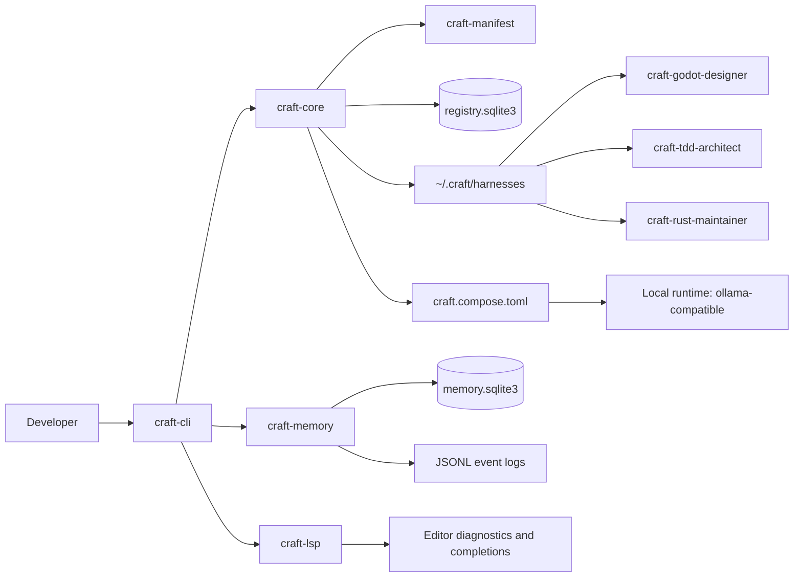
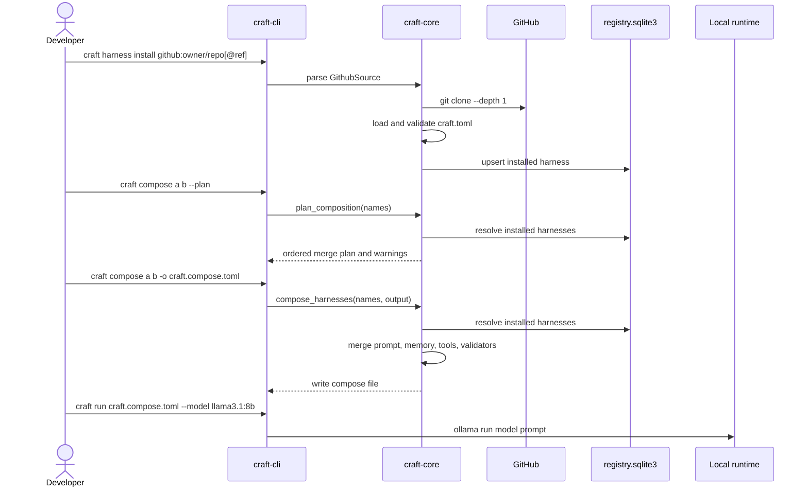
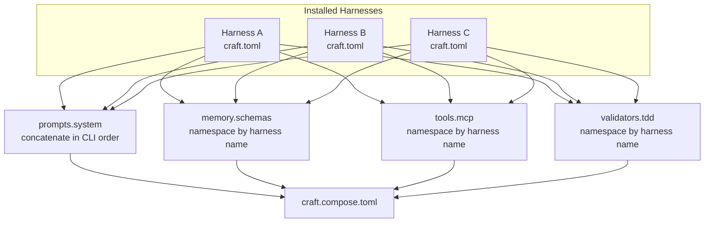
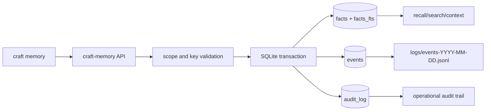

# CRAFT Architecture

CRAFT separates the core runtime from individual harness repositories.

## System Map

The CLI is the integration point. The library crates keep manifest parsing, harness loading, memory persistence, and LSP behavior separate so each surface can mature without turning the command binary into the architecture.

## Repositories

- `craft-core`: CLI, manifest model, composition engine, memory interfaces, runners, and developer tooling.
- `craft-<harness>`: one repository per expertise harness.

## Crates

- `craft-cli`: command-line entry point.
- `craft-manifest`: `craft.toml` parsing and validation.
- `craft-core`: harness project loading and future composition APIs.
- `craft-lsp`: stdio language-server protocol adapter for `craft.toml`.
- `craft-memory`: scoped SQLite memory store and JSONL event log.

## Install, Compose, Run

`craft compose --plan` is the safe inspection path for cartridge stacks. It performs the same registry and manifest resolution as `craft compose`, reports the `ordered-merge` strategy, lists artifact paths per harness, and returns duplicate-harness warnings without writing `craft.compose.toml`.

## Composition Contract

Composition deliberately treats prompt order as meaningful and keeps non-prompt artifacts namespaced. That keeps source ownership visible for runners and avoids silently flattening memory schemas, MCP bindings, or validators from multiple cartridges.

## Memory Flow

Facts are stored in SQLite, indexed through FTS, and mirrored by replayable events. `memory context` assembles scoped facts in deterministic priority order so future runners can request bounded context without knowing the storage layout.

## Milestone Path

1. Foundation: buildable workspace, CLI, manifest validation.
2. Harness discovery: install/list/info/uninstall harness repos.
3. Memory: SQLite plus JSONL event log with scoped retrieval.
4. Runner: local model adapters and tool bindings.
5. Validation: `tdd-dsl` powered harness tests.
6. Developer experience: `craft.toml` LSP diagnostics, completions, and harness navigation.
