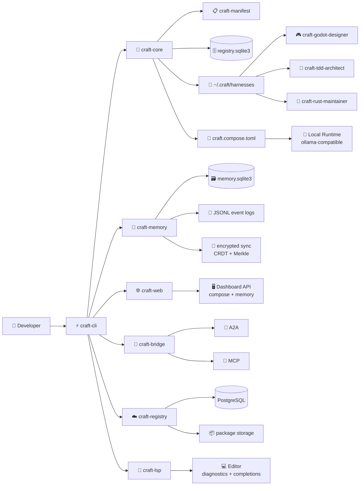
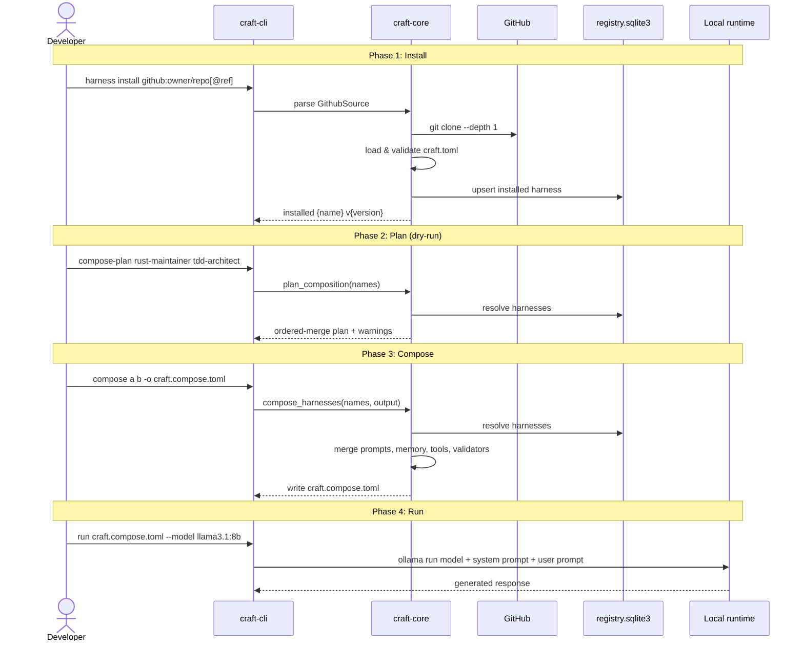
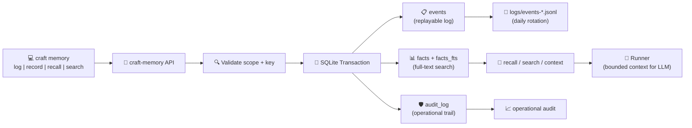

# CRAFT Architecture

> Composable Runtime for Agentic Framework Tooling

CRAFT separates the core runtime from individual harness repositories, enabling versioned, installable expertise packages.

---

## System Map



The CLI is the integration point. Library crates keep manifest parsing, harness loading, memory persistence, and LSP behavior separate so each surface can mature without bloating the command binary.

---

## In Five Commands

```bash
# 1. Initialize CRAFT in your project
craft init

# 2. Install a harness from GitHub
craft harness install github:Rosavera-I/craft-rust-maintainer

# 3. Plan composition before running
craft compose-plan rust-maintainer tdd-architect

# 4. Compose into a merged config
craft compose rust-maintainer tdd-architect -o craft.compose.toml

# 5. Run with your local LLM
craft run craft.compose.toml --model llama3.1:8b --prompt "Review error handling"
```

---

## Crate Structure

| Crate | Responsibility | API Surface |
|-------|---------------|-------------|
| `craft-cli` | Command-line parsing, user-facing errors | Binary only |
| `craft-core` | Harness loading, composition, validation | `HarnessManager`, `compose_harnesses` |
| `craft-manifest` | `craft.toml` parsing, semver validation | `load_manifest`, `Manifest` |
| `craft-lsp` | LSP stdio adapter for editor integration | `run_lsp_server` |
| `craft-memory` | SQLite facts, FTS search, JSONL events | `Memory::record`, `Memory::recall` |
| `craft-web` | Local dashboard API and validation websocket | `create_app`, `run_server` |
| `craft-bridge` | A2A and MCP interoperability | `A2AServer`, `A2AClient`, `McpServer` |
| `craft-registry` | Cloud harness registry server and CLI | `Server`, `RegistryClient` |

---

## Harness Anatomy

Each cartridge is a git repository with a standard layout:

```mermaid
flowchart TB
    subgraph Cartridge[craft-{name} Repository]
        direction TB
        Manifest["📄 craft.toml<br/>name, version, description"]
        Prompts["📝 prompts/system.md<br/>system prompt"]
        Memory["🧠 memory/schema.toml<br/>facts + events schema"]
        Tools["🔧 tools/mcp.toml<br/>MCP server definitions"]
        Validators["✅ validators/checks.tdd<br/>TDD validation rules"]
        
        Manifest --> Prompts
        Manifest --> Memory
        Manifest --> Tools
        Manifest --> Validators
    end
    
    subgraph Install["Installation"]
        Git["git clone"] --> Validate["craft validate"]
        Validate --> Registry["registry.sqlite3"]
    end
    
    Cartridge --> Git
```

---

## Install → Compose → Run



`compose-plan` is the safe inspection path. It performs the same resolution as `compose` but returns the plan without writing files. Use it to preview warnings and harness ordering before committing to a composition.

---

## Composition Contract

```mermaid
flowchart TB
    subgraph Inputs[Installed Harnesses]
        H1["🎮 Harness A<br/>prompts/system.md"]
        H2["🧪 Harness B<br/>prompts/system.md"]
        H3["🦀 Harness C<br/>prompts/system.md"]
    end
    
    subgraph Merge[Merge Strategy: Ordered]
        PromptMerge["📝 prompts.system<br/>concatenate in CLI order"]
        MemoryMerge["🧠 memory.schemas<br/>namespace by harness name"]
        ToolMerge["🔧 tools.mcp<br/>namespace by harness name"]
        ValidatorMerge["✅ validators.tdd<br/>namespace by harness name"]
    end
    
    subgraph Output[craft.compose.toml]
        P["[prompts]<br/>system = '...'"]
        M["[memory.schemas]<br/>\"a\" = '...'"]
        T["[tools.mcp]<br/>\"a\" = '...'"]
        V["[validators.tdd]<br/>\"a\" = '...'"]
    end
    
    H1 --> PromptMerge
    H2 --> PromptMerge
    H3 --> PromptMerge
    
    H1 --> MemoryMerge
    H2 --> MemoryMerge
    H3 --> MemoryMerge
    
    H1 --> ToolMerge
    H2 --> ToolMerge
    H3 --> ToolMerge
    
    H1 --> ValidatorMerge
    H2 --> ValidatorMerge
    H3 --> ValidatorMerge
    
    PromptMerge --> P
    MemoryMerge --> M
    ToolMerge --> T
    ValidatorMerge --> V
```

**Key rule:** Prompts concatenate in order (later harnesses extend earlier ones). All other artifacts are namespaced by harness name to preserve source ownership.

---

## Memory Architecture



`memory context` assembles facts in scope-priority order so runners receive relevant context without knowing the storage layout. Events append to both SQLite and JSONL for replay and audit.

---

## Command Reference

| Command | Purpose | Example |
|---------|---------|---------|
| `init` | Create `.craft/` scaffold | `craft init` |
| `harness install` | Install from GitHub | `craft harness install github:owner/repo` |
| `harness list` | Show installed harnesses | `craft harness list` |
| `harness test` | Run TDD validators | `craft harness test rust-maintainer` |
| `compose-plan` | Preview composition | `craft compose-plan a b --strategy merge` |
| `compose` | Write merged config | `craft compose a b --strategy override -o out.toml` |
| `run` | Execute with LLM | `craft run out.toml --model llama3.1:8b` |
| `validate` | Validate harness project | `craft validate ./my-harness` |
| `memory` | Record/recall facts | `craft memory log project lang rust` |
| `lsp` | Language server | `craft lsp` |
| `doctor` | Health check | `craft doctor` |

---

## Data Directory Layout

```text
~/.craft/
├── harnesses/
│   ├── godot-designer/
│   │   ├── craft.toml
│   │   ├── prompts/system.md
│   │   └── ...
│   └── rust-maintainer/
│       └── ...
├── memory.sqlite3
├── registry.sqlite3
└── logs/
    └── events-2026-06-28.jsonl
```

---

## Milestone Path

| Phase | Status | Deliverable |
|-------|--------|-------------|
| Foundation | ✅ | Buildable workspace, CLI, manifest validation |
| Harness Discovery | ✅ | install/list/info/uninstall from GitHub |
| Memory | ✅ | SQLite + JSONL with scoped retrieval |
| Runner | ✅ | Local model adapters (ollama-compatible) |
| Validation | ✅ | `tdd-dsl` powered harness tests |
| Developer Experience | 🔄 | LSP diagnostics, completions, harness navigation |
| Distribution | 📋 | crates.io publish, homebrew tap |
