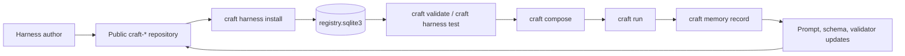
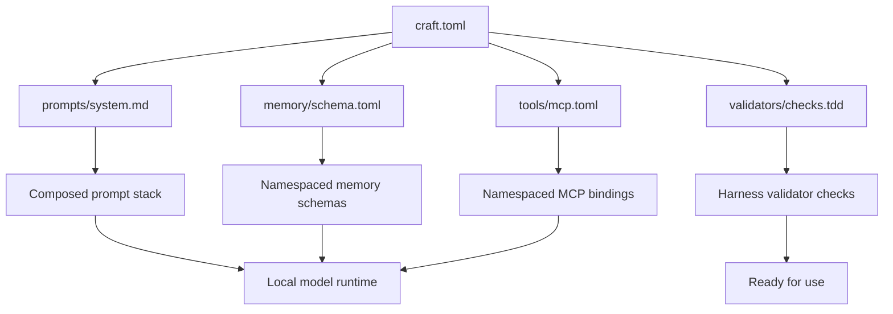
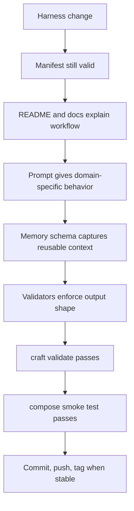

# Harness Lifecycle

CRAFT harnesses are independent repositories that move through a repeatable lifecycle: publish, install, validate, compose, run, and learn. Keeping each cartridge separate lets domain expertise evolve without coupling it to the core runtime release cadence.

## Lifecycle Map



## Artifact Contract



Every harness repository should stay small and inspectable:

```text
craft.toml
README.md
prompts/system.md
memory/schema.toml
tools/mcp.toml
validators/checks.tdd
docs/
```

## Current Starter Repositories

- [`Rosavera-I/craft-tdd-architect`](https://github.com/Rosavera-I/craft-tdd-architect): test-first behavior contracts, edge cases, fixture strategy, and red-green-refactor loops.
- [`Rosavera-I/craft-godot-designer`](https://github.com/Rosavera-I/craft-godot-designer): Godot 4 scene ownership, signal contracts, resources, tuning, and playtest feedback.
- [`Rosavera-I/craft-rust-maintainer`](https://github.com/Rosavera-I/craft-rust-maintainer): Rust review, small patches, API compatibility, verification commands, and release hygiene.

## Release Checklist



Use this checklist for cartridge updates before promoting a new tag or recommending a harness in the core README.
