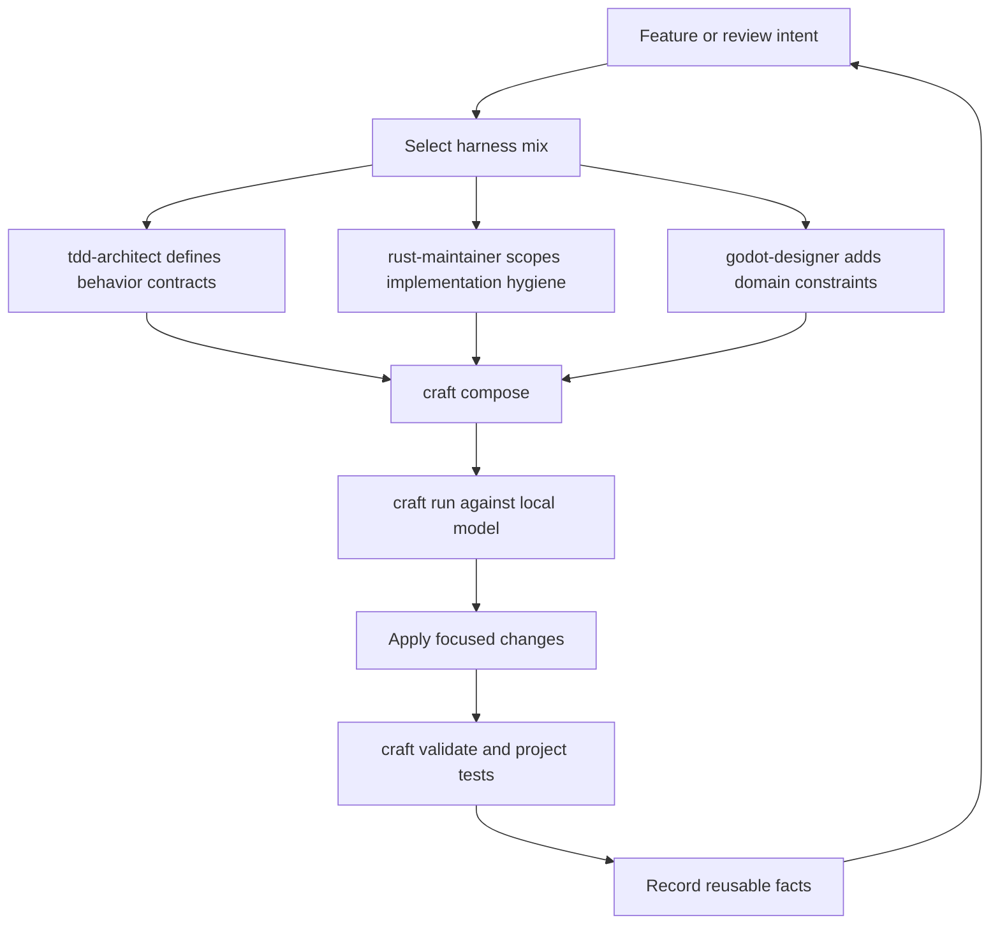
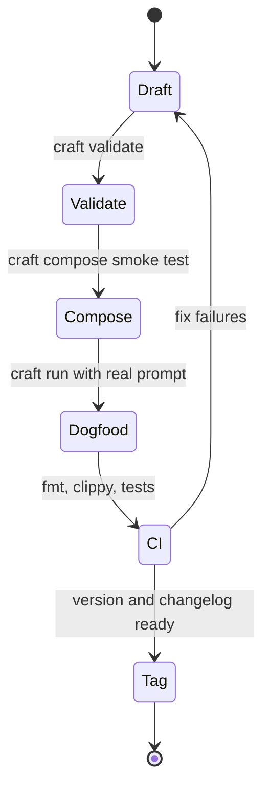

# CRAFT Stack Dogfood Plan

The first public CRAFT stack should prove a full loop: build CRAFT Core with a Rust maintenance harness, specify behavior with a TDD harness, and apply domain expertise with a Godot harness.

## Improvement Loop

## Current Public Cartridges

| Cartridge | Role | Best first use |
| --- | --- | --- |
| `craft-tdd-architect` | Turns vague intent into executable behavior contracts | Before adding a CLI command, parser rule, or regression fix |
| `craft-rust-maintainer` | Keeps Rust changes small, idiomatic, and verified | During implementation and pre-merge review |
| `craft-godot-designer` | Applies Godot 4 scene, signal, and gameplay constraints | For game feature slices and scene reviews |

## Recommended Core Dogfood

1. Compose `tdd-architect` and `rust-maintainer` for every new CRAFT CLI behavior.
2. Use `tdd-architect` alone for issue triage where the desired behavior is still vague.
3. Use `rust-maintainer` before release tags to check semver notes, MSRV expectations, clippy, tests, and dependency additions.
4. Use `godot-designer` as the first non-CRAFT domain proof: review a Godot scene or gameplay system prompt, then verify the response stays engine-specific.

## Release Readiness

Each cartridge should stay independently installable. Shared quality expectations belong in docs and validators first; common runtime behavior belongs in CRAFT Core only when at least two cartridges need it.
