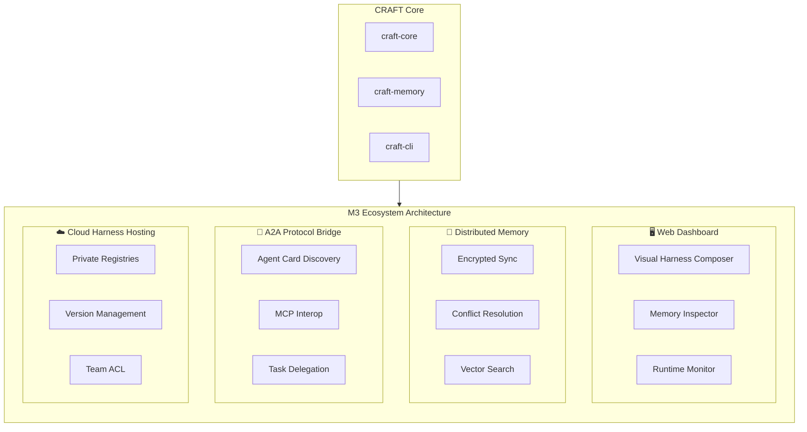
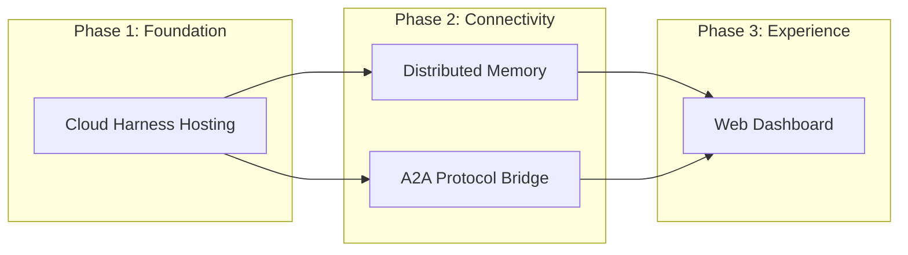

# M3 Ecosystem Architecture Overview

> Composable Runtime for Agentic Framework Tooling — Ecosystem Milestone

## Vision

M3 transforms CRAFT from a local harness runtime into a distributed, collaborative ecosystem where:
- Teams visually compose and share harnesses through a Web Dashboard
- Memory synchronizes securely across machines and team members
- Agents interoperate with external frameworks via standard protocols
- Private harness registries enable enterprise-grade distribution

## The Four Pillars

## Pillar Summary

| Pillar | Purpose | Key Challenge |
|--------|---------|---------------|
| **Web Dashboard** | Visual harness composition and system observability | Real-time composition preview with live validation |
| **Distributed Memory** | Secure memory synchronization across devices | Encrypted CRDTs for conflict resolution |
| **A2A Protocol Bridge** | Interoperability with Google A2A, MCP, and other frameworks | Protocol impedance matching |
| **Cloud Harness Hosting** | Private harness registries for teams | Git-backed package management with ACLs |

## Execution Dependencies

**Recommended Order:**

1. **Cloud Harness Hosting** — Provides the distribution backbone that other pillars depend on
2. **Distributed Memory** & **A2A Bridge** — Can be built in parallel; both need the hosting foundation
3. **Web Dashboard** — Depends on all other pillars for full functionality

## Cross-Cutting Concerns

### Security
- All external communication uses mTLS or WireGuard
- Memory encryption at rest (AES-256-GCM) and in transit
- Harness signatures for provenance verification

### Observability
- OpenTelemetry tracing across all pillars
- Structured logging compatible with craft-memory event stream
- Prometheus metrics for self-hosted registries

### Configuration
- Unified `craft.toml` extension for M3 features
- Environment-based activation (no compile-time flags)
- Sensible defaults for single-user mode

## Document Index

1. **[01-overview.md](./01-overview.md)** — This document
2. **[02-web-dashboard.md](./02-web-dashboard.md)** — Visual composition architecture
3. **[03-distributed-memory.md](./03-distributed-memory.md)** — Encrypted sync design
4. **[04-a2a-bridge.md](./04-a2a-bridge.md)** — Protocol interoperability
5. **[05-cloud-hosting.md](./05-cloud-hosting.md)** — Private registry architecture
6. **[06-execution-roadmap.md](./06-execution-roadmap.md)** — Implementation sequencing
