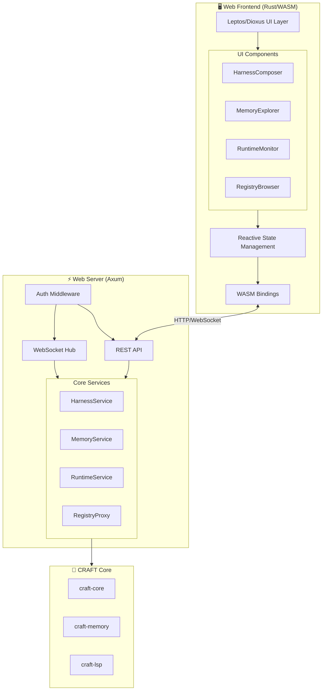
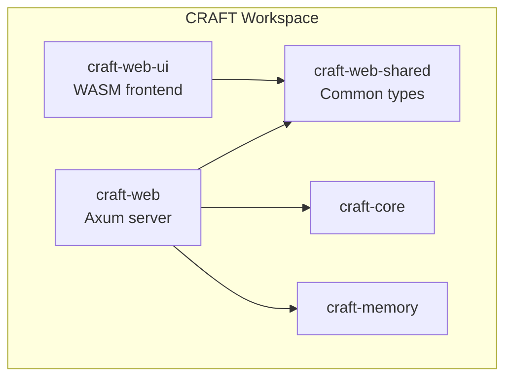
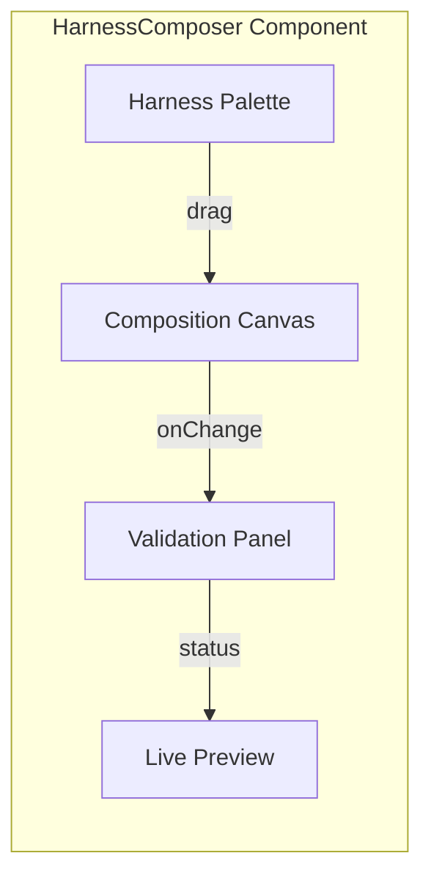
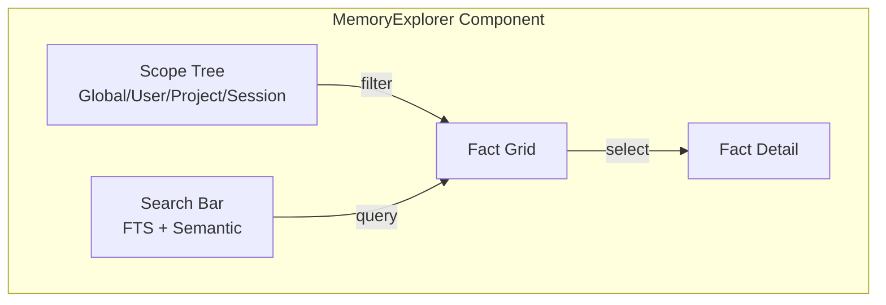
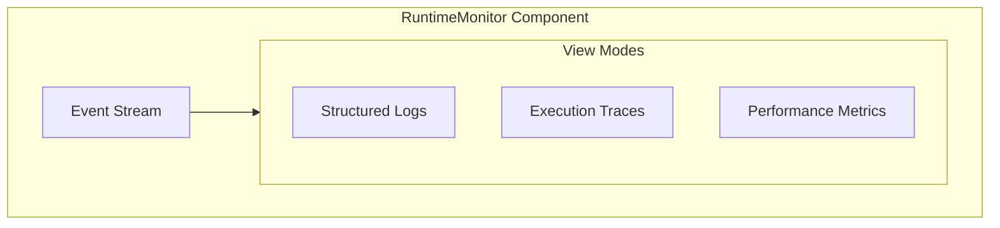
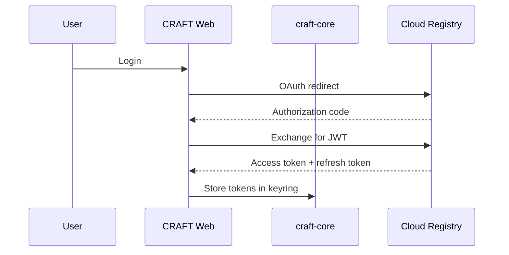

# Web Dashboard Architecture

> Visual harness composition, memory inspection, and runtime monitoring for CRAFT

## Goals

1. **Visual Harness Composer** — Drag-and-drop harness composition with real-time preview
2. **Memory Inspector** — Browse, search, and edit memory facts with full-text and semantic search
3. **Runtime Monitor** — Live execution traces, harness performance metrics, and log aggregation
4. **Registry Browser** — Explore and install harnesses from private and public registries

## Architecture Overview



## Crate Structure

### New Crates

| Crate | Purpose | Dependencies |
|-------|---------|--------------|
| `craft-web` | Axum server + WebSocket handler | axum, tokio, craft-core, craft-memory |
| `craft-web-ui` | WASM frontend components | leptos (or dioxus), wasm-bindgen |
| `craft-web-shared` | Shared types between frontend/backend | serde, ts-rs |

### Crate Diagram



## Component Details

### 1. Harness Composer



**Features:**
- Visual nodes for each harness with ports for composition
- Edge connections represent prompt/tool merging
- Real-time validation using `craft-core` composition logic
- Export to `craft.compose.toml` or direct execution

**State Management:**
```rust
#[derive(Clone, Debug, Serialize, Deserialize)]
pub struct ComposerState {
    pub nodes: Vec<HarnessNode>,
    pub edges: Vec<CompositionEdge>,
    pub validation: ValidationResult,
    pub strategy: ConflictStrategy,
}

#[derive(Clone, Debug)]
pub struct HarnessNode {
    pub id: Uuid,
    pub harness_name: String,
    pub version: String,
    pub position: (f64, f64),
    pub collapsed: bool,
    pub metadata: Manifest,
}
```

### 2. Memory Explorer



**Features:**
- Hierarchical scope browser (global → user → project → session → harness)
- Full-text search via SQLite FTS5
- Semantic search (vector similarity) via pgvector or similar
- Real-time updates from `craft-memory` event stream

**API Endpoints:**
```rust
// GET /api/memory/search?q={query}&scope={scope}
// GET /api/memory/facts?scope={scope}&limit={n}
// POST /api/memory/facts (create/update)
// DELETE /api/memory/facts/{scope}/{key}
// WS /ws/memory (live updates)
```

### 3. Runtime Monitor



**Features:**
- Live tail of `~/.craft/logs/events-*.jsonl`
- Execution trace visualization (harness → prompt → LLM call)
- Performance metrics: latency, token usage, cost estimates

### 4. Registry Browser

**Features:**
- Browse installed harnesses and available remote harnesses
- Version comparison and changelogs
- One-click install/uninstall
- Team registry switching

## Technology Choices

### Frontend Framework Options

| Option | Pros | Cons |
|--------|------|------|
| **Leptos** | Fine-grained reactivity, Rust-native, small WASM | Ecosystem maturity |
| **Dioxus** | React-like DX, cross-platform, good docs | Larger bundle size |
| **Yew** | Established, Redux-like state | Verbose, slower reactivity |

**Recommendation:** Leptos for tight CRAFT integration and minimal WASM size.

### Backend Stack

| Component | Choice | Rationale |
|-----------|--------|-----------|
| HTTP Server | Axum | Native tokio, middleware ecosystem |
| WebSockets | tokio-tungstenite | Async-first, backpressure handling |
| Auth | oauth2 + jwt | Enterprise-friendly, pluggable |
| Static Files | tower-http | Axum-native, compression |

## API Design

### REST Endpoints

```rust
// craft-web/src/api.rs

pub fn routes() -> Router<AppState> {
    Router::new()
        // Harness composition
        .route("/api/composer/nodes", get(list_harness_nodes))
        .route("/api/composer/validate", post(validate_composition))
        .route("/api/composer/export", post(export_composition))
        
        // Memory
        .route("/api/memory/search", get(search_memory))
        .route("/api/memory/facts", get(list_facts).post(upsert_fact))
        .route("/api/memory/facts/:scope/:key", delete(delete_fact))
        .route("/api/memory/events", get(stream_events))
        
        // Runtime
        .route("/api/runtime/sessions", get(list_sessions))
        .route("/api/runtime/sessions/:id", get(get_session))
        .route("/api/runtime/sessions/:id/logs", get(get_session_logs))
        
        // Registry
        .route("/api/registry/installed", get(list_installed))
        .route("/api/registry/available", get(list_available))
        .route("/api/registry/install", post(install_harness))
        .route("/api/registry/uninstall/:name", post(uninstall_harness))
}
```

### WebSocket Protocol

```rust
#[derive(Serialize, Deserialize)]
#[serde(tag = "type")]
pub enum ClientMessage {
    Subscribe { channel: String },
    Unsubscribe { channel: String },
    ComposerUpdate { state: ComposerState },
    MemoryQuery { scope: String, query: String },
}

#[derive(Serialize, Deserialize)]
#[serde(tag = "type")]
pub enum ServerMessage {
    MemoryUpdate { fact: MemoryFact },
    ValidationResult { result: ValidationResult },
    RuntimeEvent { event: RuntimeEvent },
    Error { message: String },
}
```

## Security Model

### Authentication Flow



### Authorization Levels

| Role | Permissions |
|------|-------------|
| Viewer | View memory, browse registries, see runtime |
| Operator | Install harnesses, run compositions, edit own memory |
| Admin | Manage team registries, ACLs, all memory |

## Deployment Modes

### 1. Local Mode (Default)
```bash
craft web serve --local
# Serves on localhost:8080, no auth required
```

### 2. Team Mode
```bash
craft web serve --registry https://craft.mycompany.com
# Requires authentication, team features enabled
```

### 3. Headless Mode
```bash
craft web serve --headless
# API only, no WASM frontend
```

## Integration with Existing Crates

### craft-core
- Use `HarnessManager` for registry operations
- Use `compose_harnesses` for validation/export
- Extend with web-specific state management

### craft-memory
- Use `Memory` struct for all memory operations
- Extend with vector search capabilities
- Stream events via `tokio::sync::broadcast`

### craft-lsp
- Reuse manifest validation logic
- Provide web-based diagnostics display
- Share completion providers

## Performance Considerations

1. **WASM Bundle Size**: Tree-shake Leptos, lazy-load components
2. **Memory Search**: Debounce queries, use FTS5 for prefix matching
3. **Event Streaming**: Backpressure handling, client-side buffering
4. **Composition Validation**: Cache manifest parses, incremental validation

## External Dependencies

| Crate | Purpose | Version |
|-------|---------|---------|
| axum | HTTP server | ^0.7 |
| leptos | Frontend framework | ^0.6 |
| tokio-tungstenite | WebSockets | ^0.24 |
| ts-rs | TypeScript bindings | ^9.0 |
| tower-http | Middleware | ^0.5 |

## Open Questions

1. **Vector Search**: Use pgvector extension or embed SQLite with sqlite-vec?
2. **Collaborative Editing**: Operational transforms or CRDTs for shared compositions?
3. **Mobile Support**: Responsive design or native apps via Tauri?
