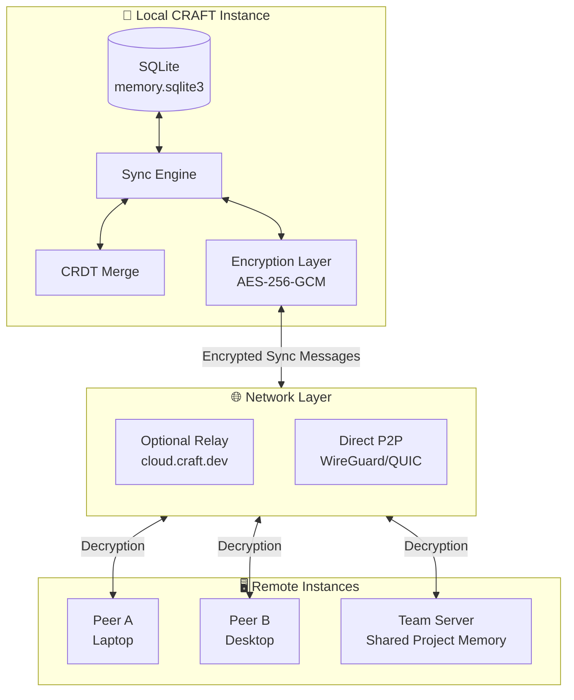
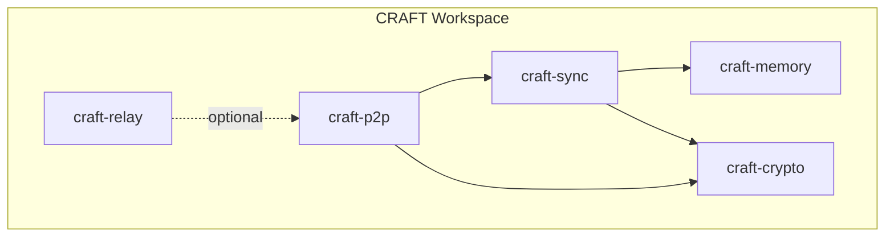
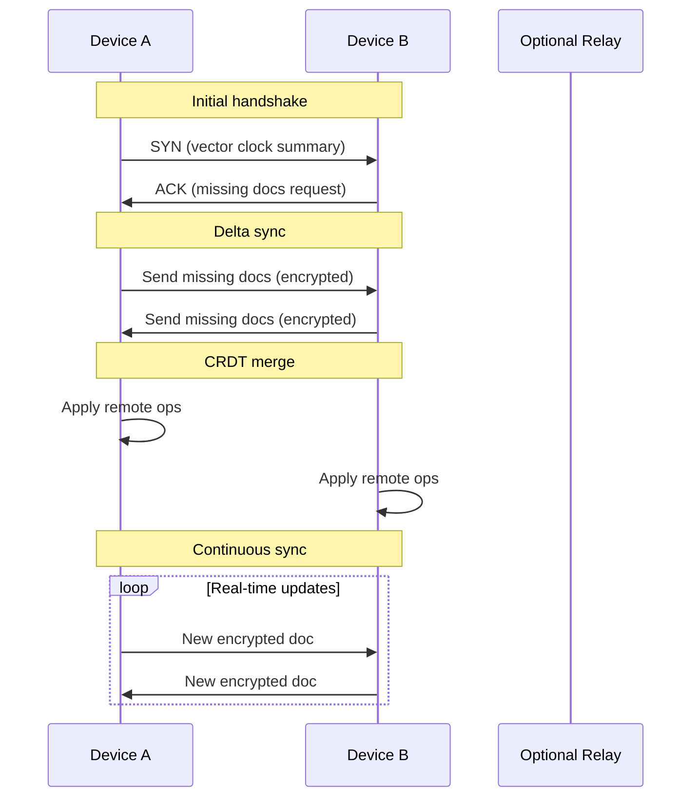

# Distributed Memory Architecture

> Secure, encrypted memory synchronization across CRAFT instances

## Goals

1. **Encrypted Sync** — Synchronize memory across devices with end-to-end encryption
2. **Conflict Resolution** — Automatic merging of concurrent edits using CRDTs
3. **Offline-First** — Local SQLite remains source of truth; sync is async
4. **Selective Sharing** — Granular control over which scopes sync to which peers
5. **Team Collaboration** — Shared project memory with access control

## Threat Model

| Threat | Mitigation |
|--------|------------|
| Eavesdropping on sync traffic | mTLS + Noise Protocol for P2P |
| Server compromise | E2E encryption; server only sees ciphertext |
| Replay attacks | Cryptographic nonces, strict ordering |
| Unauthorized access | Capability-based access control |
| Metadata leakage | Constant-size sync messages, padding |

## Architecture Overview



## Crate Structure

### New Crates

| Crate | Purpose | Dependencies |
|-------|---------|--------------|
| `craft-sync` | Core sync engine, CRDTs, conflict resolution | crdts, serde, chrono |
| `craft-crypto` | Encryption, key management, secure channels | aes-gcm, x25519-dalek, noise-rust |
| `craft-p2p` | Peer discovery, NAT traversal, direct connections | libp2p, quinn (QUIC) |
| `craft-relay` | Optional relay server for hole-punching | axum, tokio |

### Crate Dependencies



## Core Concepts

### Sync Scope

Not all memory should sync everywhere. Users control sync at scope level:

```rust
#[derive(Clone, Debug, Serialize, Deserialize)]
pub enum SyncPolicy {
    /// Never sync this scope
    LocalOnly,
    /// Sync to own devices only (encrypted to self)
    DeviceSync,
    /// Sync to specific team (encrypted to team key)
    TeamSync { team_id: String },
    /// Public read, controlled write
    PublicRead,
}

#[derive(Clone, Debug)]
pub struct ScopedSyncConfig {
    pub scope: MemoryScope,
    pub policy: SyncPolicy,
    pub conflict_strategy: ConflictStrategy,
    pub retention: RetentionPolicy,
}
```

### Encrypted Memory Document

```rust
/// The unit of synchronization - an encrypted, signed memory update
#[derive(Clone, Debug, Serialize, Deserialize)]
pub struct EncryptedMemoryDoc {
    /// Unique document ID (UUID)
    pub id: String,
    /// Scope this document belongs to (hashed for privacy)
    pub scope_hash: [u8; 32],
    /// Key identifier for decryption
    pub key_id: String,
    /// Encrypted payload (MemoryOp)
    pub ciphertext: Vec<u8>,
    /// AES-GCM nonce
    pub nonce: [u8; 12],
    /// Ed25519 signature
    pub signature: [u8; 64],
    /// Lamport timestamp for ordering
    pub timestamp: u64,
    /// Vector clock for causality tracking
    pub vector_clock: BTreeMap<String, u64>,
}

/// Decrypted operation types
#[derive(Clone, Debug, Serialize, Deserialize)]
pub enum MemoryOp {
    FactUpsert { key: String, value: String },
    FactDelete { key: String },
    EventAppend { event_type: String, payload: String },
    SchemaUpdate { schema_json: String },
}
```

## CRDT Design

### Choice: Delta-State CRDTs

We use delta-state CRDTs (conflict-free replicated data types) for:
- **Facts**: Last-Writer-Wins (LWW) register with vector clock
- **Events**: Append-only log with causality tracking
- **Schemas**: LWW register with semantic merge for TOML

```mermaid
flowchart LR
    subgraph DeviceA["Device A"]
        A1[Fact: key="lang"<br/>value="rust"<br/>vc={A:5}]
    end
    
    subgraph DeviceB["Device B"]
        B1[Fact: key="lang"<br/>value="python"<br/>vc={B:3}]
    end
    
    subgraph Merge["Merge Result"]
        M[Fact: key="lang"<br/>value="rust"<br/>vc={A:5, B:3}]
    end
    
    A1 -->|sync| Merge
    B1 -->|sync| Merge
```

### Vector Clock Implementation

```rust
#[derive(Clone, Debug, Default, Serialize, Deserialize)]
pub struct VectorClock(BTreeMap<String, u64>);

impl VectorClock {
    /// Increment our own counter
    pub fn increment(&mut self, replica_id: &str) {
        *self.0.entry(replica_id.to_string()).or_insert(0) += 1;
    }
    
    /// Compare two vector clocks
    pub fn compare(&self, other: &VectorClock) -> Ordering {
        // Returns Less, Greater, Equal, or Concurrent
    }
    
    /// Merge two vector clocks (take max of each counter)
    pub fn merge(&mut self, other: &VectorClock) {
        for (replica, counter) in &other.0 {
            self.0.entry(replica.clone())
                .and_modify(|c| *c = (*c).max(*counter))
                .or_insert(*counter);
        }
    }
}
```

## Sync Protocol

### Sync Flow



### Sync Message Format

```rust
#[derive(Serialize, Deserialize)]
pub enum SyncMessage {
    /// Initial handshake: "I have these docs"
    VectorClockSummary {
        scope_hash: [u8; 32],
        clocks: BTreeMap<String, u64>,
    },
    /// Request specific docs by ID
    FetchRequest {
        doc_ids: Vec<String>,
    },
    /// Encrypted document batch
    DocBatch {
        docs: Vec<EncryptedMemoryDoc>,
        batch_seq: u32,
        batch_total: u32,
    },
    /// Acknowledge receipt
    Ack {
        received_ids: Vec<String>,
    },
    /// Real-time update
    LiveUpdate {
        doc: EncryptedMemoryDoc,
    },
}
```

## Encryption Details

### Key Hierarchy

```
Root Key (derived from user password/hardware key)
├── Device Key Pair (X25519) - per device
├── Team Keys (AES-256) - per team
│   └── Shared among team members
└── Scope Keys (AES-256) - per sync scope
    └── Encrypted to authorized peers
```

### Key Exchange Protocol

```rust
/// X3DH-inspired key agreement for P2P sync
pub async fn establish_secure_channel(
    local_identity: &IdentityKeyPair,
    remote_identity: &IdentityPublicKey,
) -> Result<SecureChannel, CryptoError> {
    // 1. Ephemeral key generation
    let ephemeral = X25519EphemeralKey::generate();
    
    // 2. Triple DH key agreement
    let dh1 = local_identity.dh(remote_identity)?;
    let dh2 = ephemeral.dh(remote_identity)?;
    let dh3 = ephemeral.dh(remote_identity)?;
    
    // 3. KDF for session keys
    let shared_secret = kdf_dh(&[&dh1, &dh2, &dh3]);
    let (send_key, recv_key) = derive_session_keys(&shared_secret);
    
    Ok(SecureChannel::new(send_key, recv_key))
}
```

### Document Encryption

```rust
impl EncryptedMemoryDoc {
    pub fn encrypt(
        op: &MemoryOp,
        scope_key: &Aes256Key,
        signing_key: &Ed25519SecretKey,
    ) -> Result<Self, CryptoError> {
        let plaintext = serde_json::to_vec(op)?;
        let nonce = Aes256Gcm::generate_nonce(&mut OsRng);
        
        let cipher = Aes256Gcm::new(scope_key);
        let ciphertext = cipher.encrypt(&nonce, plaintext.as_ref())?;
        
        let to_sign = [&id.as_bytes(), &scope_hash[..], &ciphertext[..]].concat();
        let signature = signing_key.sign(&to_sign);
        
        Ok(Self {
            id: generate_uuid(),
            scope_hash: hash_scope(&op.scope()),
            key_id: derive_key_id(scope_key),
            ciphertext: ciphertext.to_vec(),
            nonce: nonce.into(),
            signature: signature.to_bytes(),
            timestamp: now(),
            vector_clock: op.vector_clock().clone(),
        })
    }
}
```

## Network Layer

### Transport Options

| Mode | Use Case | Protocol |
|------|----------|----------|
| Direct P2P | Same network, low latency | QUIC + Noise |
| Relayed | NAT traversal needed | QUIC via relay |
| Hybrid | General case | P2P preferred, relay fallback |

### QUIC Configuration

```rust
pub fn create_quic_endpoint(
    bind_addr: SocketAddr,
    identity: &IdentityKeyPair,
) -> Result<Endpoint, P2PError> {
    let mut client_config = ClientConfig::new(Arc::new(
        QuicClientConfig::try_from(
            rustls::ClientConfig::builder()
                .dangerous()
                .with_custom_certificate_verifier(Arc::new(CraftCertVerifier))
                .with_no_client_auth()
        )?
    ));
    
    let mut server_config = ServerConfig::new(
        QuicServerConfig::try_from(
            rustls::ServerConfig::builder()
                .with_no_client_auth()
                .with_single_cert(cert_chain, private_key)?
        )?
    );
    
    // Enable 0-RTT for fast reconnection
    server_config.use_retry(true);
    client_config.enable_0rtt();
    
    Ok(Endpoint::new(EndpointConfig::default(), server_config, bind_addr)?)
}
```

### NAT Traversal

```rust
/// Hole-punching via optional relay
pub async fn connect_to_peer(
    peer_id: &PeerId,
    relay: Option<&RelayAddr>,
) -> Result<Connection, P2PError> {
    // 1. Try direct connection first
    if let Ok(conn) = try_direct_connect(peer_id).await {
        return Ok(conn);
    }
    
    // 2. Use relay for coordinated hole-punching
    if let Some(relay) = relay {
        let relay_conn = connect_to_relay(relay).await?;
        let (our_addr, their_addr) = relay_coordination(relay_conn, peer_id).await?;
        
        // 3. Simultaneous open
        match tokio::time::timeout(
            Duration::from_secs(5),
            simultaneous_open(our_addr, their_addr)
        ).await {
            Ok(conn) => return Ok(conn),
            Err(_) => {
                // 4. Fall back to relayed connection
                relay_relayed_connection(relay_conn, peer_id).await
            }
        }
    } else {
        Err(P2PError::Unreachable)
    }
}
```

## Configuration

### User Configuration

```toml
# ~/.craft/sync.toml
[sync]
enabled = true
device_name = "work-laptop"
identity_key_path = "~/.craft/keys/device.key"

[sync.network]
listen_addr = "0.0.0.0:0"  # Random port
relay_servers = ["relay.craft.dev:443"]
discovery = ["mdns", "dht"]

[[sync.peers]]
name = "home-desktop"
peer_id = "12D3KooW..."
allowed_scopes = ["project:mygame", "harness:godot-designer"]

[[sync.teams]]
team_id = "mycompany"
server_url = "https://craft.mycompany.com/sync"
auth_token = "env:CRAFT_TEAM_TOKEN"
shared_scopes = ["project:company-project"]

[sync.scopes]
# Override default policy per scope
"session:*" = "local-only"
"global" = "device-sync"
"project:*" = "team-sync"
```

## Integration with craft-memory

```rust
impl Memory {
    /// Enable sync for this memory instance
    pub fn with_sync(
        mut self,
        config: SyncConfig,
    ) -> Result<SyncEnabledMemory, SyncError> {
        let sync_engine = SyncEngine::new(config)?;
        
        // Subscribe to local changes
        let (tx, rx) = tokio::sync::mpsc::channel(100);
        self.subscribe(tx);
        
        // Spawn sync task
        tokio::spawn(sync_engine.run(rx));
        
        Ok(SyncEnabledMemory {
            memory: self,
            sync: sync_engine,
        })
    }
}

/// Sync-aware memory operations
impl SyncEnabledMemory {
    pub async fn record(
        &self,
        scope: MemoryScope,
        key: impl AsRef<str>,
        value: impl AsRef<str>,
    ) -> Result<MemoryFact, MemoryError> {
        // 1. Record locally first (always works offline)
        let fact = self.memory.record(scope.clone(), key, value).await?;
        
        // 2. Queue for sync if scope is synced
        if self.sync.should_sync(&scope) {
            let op = MemoryOp::FactUpsert {
                key: fact.key.clone(),
                value: fact.value.clone(),
            };
            self.sync.queue_op(scope, op).await?;
        }
        
        Ok(fact)
    }
}
```

## Conflict Resolution Strategies

| Strategy | Use Case | Behavior |
|----------|----------|----------|
| **LWW** (default) | Most facts | Higher vector clock wins, timestamp tiebreaker |
| **Append** | Events | Both values kept, sorted by vector clock |
| **Merge** | Structured data | Deep merge with schema-aware resolution |
| **Manual** | Critical data | Flag conflict, require user resolution |

```rust
pub fn resolve_conflict(
    local: &MemoryOp,
    remote: &MemoryOp,
    strategy: ConflictStrategy,
) -> Resolution {
    match strategy {
        ConflictStrategy::Lww => {
            match local.vector_clock().compare(remote.vector_clock()) {
                Ordering::Less => Resolution::TakeRemote,
                Ordering::Greater => Resolution::TakeLocal,
                Ordering::Equal | Ordering::Concurrent => {
                    // Timestamp tiebreaker
                    if local.timestamp() >= remote.timestamp() {
                        Resolution::TakeLocal
                    } else {
                        Resolution::TakeRemote
                    }
                }
            }
        }
        ConflictStrategy::Append => Resolution::KeepBoth,
        ConflictStrategy::Merge => Resolution::Merged(merge_values(local, remote)),
        ConflictStrategy::Manual => Resolution::Conflict(local.clone(), remote.clone()),
    }
}
```

## External Dependencies

| Crate | Purpose | Version |
|-------|---------|---------|
| crdts | Delta-state CRDTs | ^7.0 |
| aes-gcm | Authenticated encryption | ^0.10 |
| x25519-dalek | ECDH key exchange | ^2.0 |
| ed25519-dalek | Digital signatures | ^2.0 |
| quinn | QUIC protocol | ^0.11 |
| libp2p | P2P networking (optional) | ^0.54 |
| sodiumoxide | libsodium bindings (alt) | ^0.2 |

## Open Questions

1. **Storage Overhead**: Keep full CRDT history or compact periodically?
2. **Mobile Support**: How to handle iOS background restrictions?
3. **Team Key Rotation**: Forward secrecy vs. audit trail tradeoffs?
4. **Garbage Collection**: When can we safely delete old document versions?
