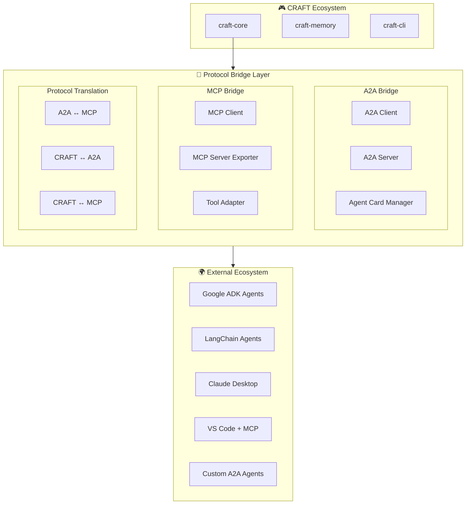
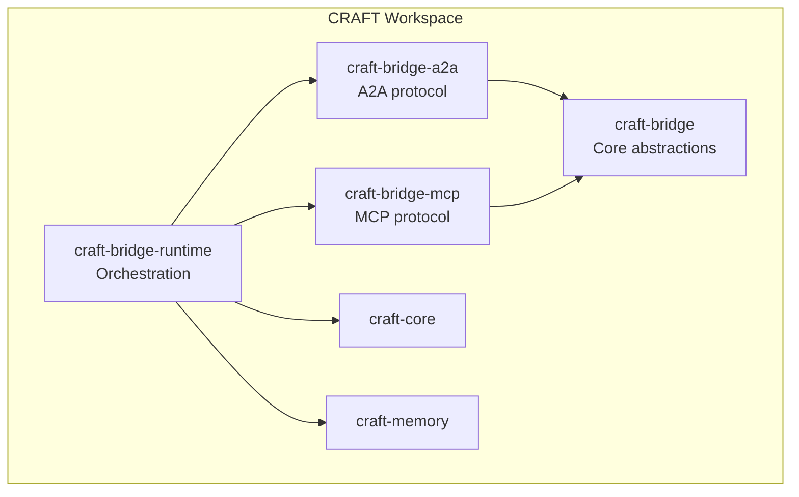

# A2A Protocol Bridge Architecture

> Interoperability between CRAFT and external agent frameworks

## Goals

1. **Agent Discovery** — Discover and communicate with A2A-compliant agents
2. **MCP Integration** — Expose CRAFT capabilities as MCP servers; consume MCP servers as tools
3. **Protocol Translation** — Seamless bridging between A2A, MCP, and native CRAFT protocols
4. **Task Delegation** — Delegate work to external agents while preserving context

## Protocol Comparison

| Feature | A2A (Google) | MCP (Anthropic) | CRAFT Native |
|---------|--------------|-----------------|--------------|
| **Transport** | HTTP/JSON-RPC 2.0 | stdio or HTTP | CLI, SQLite, files |
| **Discovery** | Agent Cards | Server config | Registry (SQLite) |
| **Unit of Work** | Task | Request/Tool call | Harness execution |
| **Streaming** | SSE | stdio streaming | JSONL events |
| **State** | Stateful (task lifecycle) | Stateless | Stateful (memory) |
| **Content** | Parts (text/file/data) | Text/resources | TOML/MD files |
| **Auth** | OAuth 2.1 | None (local) | Keyring (local) |

## Architecture Overview



## Crate Structure

### New Crates

| Crate | Purpose | Dependencies |
|-------|---------|--------------|
| `craft-bridge` | Core protocol abstractions and translation | serde, async-trait |
| `craft-bridge-a2a` | A2A protocol implementation | reqwest, jsonrpc-core |
| `craft-bridge-mcp` | MCP protocol implementation | tower-lsp, jsonrpc-core |
| `craft-bridge-runtime` | Bridge runtime and orchestration | tokio, craft-core |

### Crate Dependencies



## A2A Protocol Implementation

### Agent Card

```rust
/// A2A Agent Card representation
#[derive(Clone, Debug, Serialize, Deserialize)]
pub struct AgentCard {
    /// Agent name
    pub name: String,
    /// Human-readable description
    pub description: String,
    /// Version of this agent
    pub version: String,
    /// Base URL for agent endpoints
    pub url: String,
    /// Capabilities supported
    pub capabilities: Capabilities,
    /// Skills offered by this agent
    pub skills: Vec<Skill>,
    /// Authentication requirements
    pub authentication: Option<Authentication>,
    /// Default input modes
    pub default_input_modes: Vec<String>,
    /// Default output modes  
    pub default_output_modes: Vec<String>,
}

#[derive(Clone, Debug, Serialize, Deserialize)]
pub struct Capabilities {
    /// Supports streaming via SSE
    pub streaming: bool,
    /// Supports push notifications
    pub push_notifications: bool,
    /// Supports state transition history
    pub state_transition_history: bool,
}

#[derive(Clone, Debug, Serialize, Deserialize)]
pub struct Skill {
    pub id: String,
    pub name: String,
    pub description: String,
    pub tags: Vec<String>,
    pub examples: Vec<String>,
}
```

### A2A Client

```rust
/// Client for connecting to A2A agents
pub struct A2AClient {
    http_client: reqwest::Client,
    agent_card: AgentCard,
    auth_token: Option<String>,
}

impl A2AClient {
    /// Discover agent by URL (fetches /.well-known/agent.json)
    pub async fn discover(agent_url: &str) -> Result<AgentCard, A2AError> {
        let well_known = format!("{}/.well-known/agent.json", agent_url.trim_end_matches('/'));
        let response = reqwest::get(&well_known).await?;
        let card: AgentCard = response.json().await?;
        Ok(card)
    }
    
    /// Send a message and receive a task
    pub async fn send_message(
        &self,
        message: Message,
        config: Option<TaskConfig>,
    ) -> Result<Task, A2AError> {
        let request = SendMessageRequest {
            message,
            config,
            push_notification: None,
        };
        
        let response = self
            .http_client
            .post(format!("{}/a2a", self.agent_card.url))
            .json(&json!({
                "jsonrpc": "2.0",
                "id": 1,
                "method": "tasks/send",
                "params": request,
            }))
            .send()
            .await?;
            
        let json_response: JsonRpcResponse<Task> = response.json().await?;
        Ok(json_response.result)
    }
    
    /// Send message with streaming (Server-Sent Events)
    pub async fn send_message_stream(
        &self,
        message: Message,
    ) -> Result<impl Stream<Item = Result<StreamEvent, A2AError>>, A2AError> {
        let request = SendMessageRequest {
            message,
            config: None,
            push_notification: None,
        };
        
        let response = self
            .http_client
            .post(format!("{}/a2a", self.agent_card.url))
            .json(&json!({
                "jsonrpc": "2.0",
                "id": 1,
                "method": "tasks/sendSubscribe",
                "params": request,
            }))
            .send()
            .await?;
            
        // Parse SSE stream
        Ok(parse_sse_stream(response))
    }
    
    /// Get task status and artifacts
    pub async fn get_task(&self, task_id: &str) -> Result<Task, A2AError> {
        let response = self
            .http_client
            .post(format!("{}/a2a", self.agent_card.url))
            .json(&json!({
                "jsonrpc": "2.0",
                "id": 1,
                "method": "tasks/get",
                "params": { "id": task_id },
            }))
            .send()
            .await?;
            
        let json_response: JsonRpcResponse<Task> = response.json().await?;
        Ok(json_response.result)
    }
}
```

### A2A Server (Export CRAFT as A2A Agent)

```rust
/// Axum handler for A2A protocol
pub async fn a2a_handler(
    State(state): State<Arc<BridgeState>>,
    Json(request): Json<JsonRpcRequest>,
) -> Result<Json<JsonRpcResponse>, StatusCode> {
    let result = match request.method.as_str() {
        "tasks/send" => handle_send_task(&state, request.params).await,
        "tasks/sendSubscribe" => handle_send_subscribe(&state, request.params).await,
        "tasks/get" => handle_get_task(&state, request.params).await,
        "tasks/cancel" => handle_cancel_task(&state, request.params).await,
        _ => return Err(StatusCode::METHOD_NOT_ALLOWED),
    };
    
    match result {
        Ok(result) => Ok(Json(JsonRpcResponse {
            jsonrpc: "2.0".to_string(),
            id: request.id,
            result: Some(result),
            error: None,
        })),
        Err(e) => Ok(Json(JsonRpcResponse {
            jsonrpc: "2.0".to_string(),
            id: request.id,
            result: None,
            error: Some(JsonRpcError {
                code: e.code(),
                message: e.to_string(),
            }),
        })),
    }
}

async fn handle_send_task(
    state: &BridgeState,
    params: serde_json::Value,
) -> Result<serde_json::Value, BridgeError> {
    let request: SendMessageRequest = serde_json::from_value(params)?;
    
    // Convert A2A message to CRAFT harness invocation
    let harness_name = detect_harness_from_message(&request.message)?;
    let prompt = extract_prompt_from_message(&request.message)?;
    
    // Execute via craft-core
    let result = state
        .craft_runtime
        .run_harness(&harness_name, &prompt)
        .await?;
    
    // Convert result to A2A Task
    let task = Task {
        id: generate_task_id(),
        status: TaskState::Completed,
        artifacts: vec![Artifact {
            parts: vec![Part::Text { text: result }],
        }],
        history: vec![request.message],
    };
    
    Ok(serde_json::to_value(task)?)
}
```

## MCP Protocol Implementation

### MCP Client (Consume MCP Servers)

```rust
/// Client for MCP servers
pub enum MCPClient {
    /// Local stdio-based server
    Stdio { process: Child, transport: StdioTransport },
    /// Remote HTTP-based server
    Http { base_url: String, client: reqwest::Client },
}

impl MCPClient {
    /// Connect to local MCP server via stdio
    pub async fn connect_stdio(command: &str, args: &[&str]) -> Result<Self, MCPError> {
        let mut process = Command::new(command)
            .args(args)
            .stdin(Stdio::piped())
            .stdout(Stdio::piped())
            .stderr(Stdio::null())
            .spawn()?;
            
        let transport = StdioTransport::new(
            process.stdout.take().unwrap(),
            process.stdin.take().unwrap(),
        );
        
        let mut client = Self::Stdio { process, transport };
        client.initialize().await?;
        Ok(client)
    }
    
    /// Initialize MCP session
    async fn initialize(&mut self) -> Result<InitializeResult, MCPError> {
        let request = InitializeRequest {
            protocol_version: "2024-11-05".to_string(),
            capabilities: ClientCapabilities {
                tools: Some(ToolsCapability {}),
                resources: Some(ResourcesCapability {}),
                prompts: Some(PromptsCapability {}),
            },
            client_info: Implementation {
                name: "craft-mcp".to_string(),
                version: env!("CARGO_PKG_VERSION").to_string(),
            },
        };
        
        self.send_request("initialize", request).await
    }
    
    /// List available tools
    pub async fn list_tools(&mut self) -> Result<Vec<Tool>, MCPError> {
        let response: ListToolsResponse = self.send_request("tools/list", ()).await?;
        Ok(response.tools)
    }
    
    /// Call a tool
    pub async fn call_tool(
        &mut self,
        name: &str,
        arguments: serde_json::Value,
    ) -> Result<CallToolResult, MCPError> {
        let request = CallToolRequest {
            name: name.to_string(),
            arguments,
        };
        self.send_request("tools/call", request).await
    }
    
    /// Read resource
    pub async fn read_resource(&mut self, uri: &str) -> Result<Resource, MCPError> {
        let request = ReadResourceRequest { uri: uri.to_string() };
        self.send_request("resources/read", request).await
    }
}
```

### MCP Server (Export CRAFT as MCP Server)

```rust
/// MCP server exposing CRAFT capabilities
pub struct CraftMcpServer {
    craft_home: CraftHome,
    harness_manager: HarnessManager,
    memory: Memory,
}

impl CraftMcpServer {
    /// Start MCP server on stdio
    pub async fn serve_stdio(&self) -> Result<(), MCPError> {
        let stdin = tokio::io::stdin();
        let stdout = tokio::io::stdout();
        
        let transport = StdioTransport::new(stdin, stdout);
        self.run_server(transport).await
    }
    
    /// Start MCP server over HTTP
    pub async fn serve_http(&self, bind_addr: SocketAddr) -> Result<(), MCPError> {
        let app = Router::new()
            .route("/mcp", post(mcp_http_handler))
            .route("/mcp/sse", get(mcp_sse_handler))
            .with_state(Arc::new(self.clone()));
            
        let listener = tokio::net::TcpListener::bind(bind_addr).await?;
        axum::serve(listener, app).await?;
        Ok(())
    }
    
    /// Handle MCP requests
    async fn handle_request(
        &self,
        method: &str,
        params: serde_json::Value,
    ) -> Result<serde_json::Value, MCPError> {
        match method {
            "initialize" => self.handle_initialize(params).await,
            "tools/list" => self.handle_list_tools().await,
            "tools/call" => self.handle_call_tool(params).await,
            "resources/list" => self.handle_list_resources().await,
            "resources/read" => self.handle_read_resource(params).await,
            "prompts/list" => self.handle_list_prompts().await,
            "prompts/get" => self.handle_get_prompt(params).await,
            _ => Err(MCPError::MethodNotFound),
        }
    }
    
    async fn handle_list_tools(&self) -> Result<serde_json::Value, MCPError> {
        let tools = vec![
            // Tool: Run harness
            Tool {
                name: "craft_run_harness".to_string(),
                description: "Run a CRAFT harness with a prompt".to_string(),
                input_schema: serde_json::json!({
                    "type": "object",
                    "properties": {
                        "harness": { "type": "string", "description": "Name of harness to run" },
                        "prompt": { "type": "string", "description": "Prompt to send to harness" },
                        "model": { "type": "string", "description": "Optional model override" }
                    },
                    "required": ["harness", "prompt"]
                }),
            },
            // Tool: Search memory
            Tool {
                name: "craft_search_memory".to_string(),
                description: "Search CRAFT memory facts".to_string(),
                input_schema: serde_json::json!({
                    "type": "object",
                    "properties": {
                        "query": { "type": "string", "description": "Search query" },
                        "scope": { "type": "string", "description": "Memory scope (global, user, project, session)" }
                    },
                    "required": ["query"]
                }),
            },
            // Tool: Recall fact
            Tool {
                name: "craft_recall_fact".to_string(),
                description: "Recall a specific fact from CRAFT memory".to_string(),
                input_schema: serde_json::json!({
                    "type": "object",
                    "properties": {
                        "key": { "type": "string", "description": "Fact key" },
                        "scope": { "type": "string", "description": "Memory scope" }
                    },
                    "required": ["key"]
                }),
            },
            // Tool: Install harness
            Tool {
                name: "craft_install_harness".to_string(),
                description: "Install a harness from GitHub".to_string(),
                input_schema: serde_json::json!({
                    "type": "object",
                    "properties": {
                        "source": { "type": "string", "description": "GitHub source (github:owner/repo)" }
                    },
                    "required": ["source"]
                }),
            },
        ];
        
        Ok(serde_json::to_value(ListToolsResponse { tools })?)
    }
    
    async fn handle_call_tool(
        &self,
        params: serde_json::Value,
    ) -> Result<serde_json::Value, MCPError> {
        let request: CallToolRequest = serde_json::from_value(params)?;
        
        let result = match request.name.as_str() {
            "craft_run_harness" => {
                let harness = request.arguments["harness"].as_str().unwrap();
                let prompt = request.arguments["prompt"].as_str().unwrap();
                let output = self.run_harness(harness, prompt).await?;
                CallToolResult {
                    content: vec![ToolContent::Text { text: output }],
                    is_error: false,
                }
            }
            "craft_search_memory" => {
                let query = request.arguments["query"].as_str().unwrap();
                let scope = request.arguments.get("scope").and_then(|s| s.as_str());
                let facts = self.search_memory(query, scope).await?;
                CallToolResult {
                    content: vec![ToolContent::Text { text: format_facts(facts) }],
                    is_error: false,
                }
            }
            _ => return Err(MCPError::ToolNotFound(request.name)),
        };
        
        Ok(serde_json::to_value(result)?)
    }
}
```

## Protocol Translation

### A2A ↔ MCP Translation

```rust
/// Translate between A2A and MCP protocols
pub struct ProtocolTranslator;

impl ProtocolTranslator {
    /// Convert A2A Task to MCP Tool call
    pub fn a2a_task_to_mcp_call(task: &Task) -> Result<CallToolRequest, TranslationError> {
        // Extract tool name from task metadata or skill ID
        let tool_name = task.metadata.get("tool_name")
            .ok_or(TranslationError::MissingToolName)?
            .as_str()
            .ok_or(TranslationError::InvalidToolName)?;
            
        // Convert A2A message parts to tool arguments
        let arguments = if let Some(last_message) = task.history.last() {
            Self::parts_to_json(&last_message.parts)?
        } else {
            serde_json::json!({})
        };
        
        Ok(CallToolRequest {
            name: tool_name.to_string(),
            arguments,
        })
    }
    
    /// Convert MCP Tool result to A2A Task
    pub fn mcp_result_to_a2a_task(
        tool_result: &CallToolResult,
        original_task_id: &str,
    ) -> Task {
        let parts: Vec<Part> = tool_result.content.iter().map(|c| match c {
            ToolContent::Text { text } => Part::Text { text: text.clone() },
            ToolContent::Image { data, mime_type } => Part::File {
                name: "image".to_string(),
                mime_type: mime_type.clone(),
                bytes: BASE64.decode(data).unwrap_or_default(),
            },
            ToolContent::Resource { resource } => Part::Data {
                data: resource.contents.clone(),
            },
        }).collect();
        
        Task {
            id: original_task_id.to_string(),
            status: if tool_result.is_error {
                TaskState::Failed
            } else {
                TaskState::Completed
            },
            artifacts: vec![Artifact { parts }],
            history: vec![],
        }
    }
    
    /// Convert MCP Tool to A2A Skill
    pub fn mcp_tool_to_a2a_skill(tool: &Tool) -> Skill {
        Skill {
            id: tool.name.clone(),
            name: tool.name.clone(),
            description: tool.description.clone(),
            tags: vec!["mcp".to_string()],
            examples: vec![],
        }
    }
    
    /// Convert A2A Skill to MCP Tool
    pub fn a2a_skill_to_mcp_tool(skill: &Skill) -> Tool {
        Tool {
            name: skill.id.clone(),
            description: skill.description.clone(),
            input_schema: serde_json::json!({
                "type": "object",
                "properties": {
                    "message": { "type": "string" }
                },
                "required": ["message"]
            }),
        }
    }
}
```

### CRAFT ↔ A2A Translation

```rust
/// Translate between CRAFT native and A2A
pub struct CraftA2ATranslator;

impl CraftA2ATranslator {
    /// Convert CRAFT harness manifest to A2A Agent Card
    pub fn harness_to_agent_card(
        harness: &InstalledHarness,
        manifest: &Manifest,
    ) -> AgentCard {
        AgentCard {
            name: manifest.harness.name.clone(),
            description: manifest.harness.description.clone(),
            version: manifest.harness.version.clone(),
            url: format!("http://localhost:{}/a2a", CRAFT_BRIDGE_PORT),
            capabilities: Capabilities {
                streaming: false,
                push_notifications: false,
                state_transition_history: false,
            },
            skills: vec![Skill {
                id: manifest.harness.name.clone(),
                name: manifest.harness.name.clone(),
                description: manifest.harness.description.clone(),
                tags: manifest.model.recommended.clone(),
                examples: vec![],
            }],
            authentication: None,
            default_input_modes: vec!["text".to_string()],
            default_output_modes: vec!["text".to_string()],
        }
    }
    
    /// Convert A2A message to CRAFT prompt
    pub fn a2a_message_to_craft_prompt(message: &Message) -> String {
        message.parts.iter().map(|part| match part {
            Part::Text { text } => text.clone(),
            Part::File { name, bytes, .. } => {
                format!("[File: {} ({} bytes)]", name, bytes.len())
            }
            Part::Data { data } => data.to_string(),
        }).collect::<Vec<_>>().join("\n")
    }
    
    /// Convert CRAFT execution result to A2A Task
    pub fn craft_result_to_a2a_task(
        result: &ExecutionResult,
        task_id: &str,
    ) -> Task {
        Task {
            id: task_id.to_string(),
            status: if result.success {
                TaskState::Completed
            } else {
                TaskState::Failed
            },
            artifacts: vec![Artifact {
                parts: vec![Part::Text { text: result.output.clone() }],
            }],
            history: vec![],
        }
    }
}
```

## Integration with craft-core

### Bridge Runtime

```rust
/// Runtime that manages all protocol bridges
pub struct BridgeRuntime {
    /// A2A agents we can connect to
    a2a_clients: HashMap<String, A2AClient>,
    /// MCP servers we can use as tools
    mcp_clients: HashMap<String, MCPClient>,
    /// Our A2A server (if enabled)
    a2a_server: Option<A2AServer>,
    /// Our MCP server (if enabled)
    mcp_server: Option<CraftMcpServer>,
    /// Craft runtime for harness execution
    craft: Arc<CraftRuntime>,
}

impl BridgeRuntime {
    /// Load bridge configuration
    pub async fn from_config(
        config: &BridgeConfig,
        craft: Arc<CraftRuntime>,
    ) -> Result<Self, BridgeError> {
        let mut runtime = Self {
            a2a_clients: HashMap::new(),
            mcp_clients: HashMap::new(),
            a2a_server: None,
            mcp_server: None,
            craft,
        };
        
        // Initialize A2A clients
        for agent_config in &config.a2a_agents {
            let client = A2AClient::discover(&agent_config.url).await?;
            runtime.a2a_clients.insert(agent_config.name.clone(), client);
        }
        
        // Initialize MCP clients
        for server_config in &config.mcp_servers {
            let client = match &server_config.transport {
                McpTransport::Stdio { command, args } => {
                    MCPClient::connect_stdio(command, args).await?
                }
                McpTransport::Http { url } => {
                    MCPClient::connect_http(url).await?
                }
            };
            runtime.mcp_clients.insert(server_config.name.clone(), client);
        }
        
        // Start our A2A server if enabled
        if config.a2a_server.enabled {
            runtime.a2a_server = Some(A2AServer::new(
                config.a2a_server.bind_addr,
                craft.clone(),
            ).await?);
        }
        
        // Start our MCP server if enabled
        if config.mcp_server.enabled {
            runtime.mcp_server = Some(CraftMcpServer::new(craft.clone()));
        }
        
        Ok(runtime)
    }
    
    /// Execute via best available protocol
    pub async fn execute(
        &self,
        target: &str,
        input: &str,
    ) -> Result<String, BridgeError> {
        // Try A2A first
        if let Some(client) = self.a2a_clients.get(target) {
            let message = Message {
                role: "user".to_string(),
                parts: vec![Part::Text { text: input.to_string() }],
            };
            let task = client.send_message(message, None).await?;
            return Ok(extract_text_from_task(&task));
        }
        
        // Try MCP
        if let Some(client) = self.mcp_clients.get(target) {
            let result = client.call_tool("execute", serde_json::json!({
                "input": input
            })).await?;
            return Ok(extract_text_from_mcp_result(&result));
        }
        
        // Fall back to native CRAFT
        if let Ok(output) = self.craft.run_harness(target, input).await {
            return Ok(output);
        }
        
        Err(BridgeError::TargetNotFound(target.to_string()))
    }
}
```

## CLI Integration

```bash
# Discover A2A agents
craft bridge discover https://agent.example.com

# Connect to MCP server
craft bridge connect-mcp filesystem -- node /path/to/mcp-server-filesystem/index.js

# List connected bridges
craft bridge list

# Execute via bridge
craft bridge run my-a2a-agent "Analyze this code"
craft bridge run mcp:filesystem -- tools/read_file {"path": "/etc/hosts"}

# Export CRAFT as A2A agent
craft bridge serve-a2a --bind 0.0.0.0:8080

# Export CRAFT as MCP server
craft bridge serve-mcp --stdio  # For Claude Desktop
craft bridge serve-mcp --http --bind 0.0.0.0:8081
```

## External Dependencies

| Crate | Purpose | Version |
|-------|---------|---------|
| reqwest | HTTP client for A2A | ^0.12 |
| jsonrpc-core | JSON-RPC protocol | ^18.0 |
| tower-lsp | LSP/MCP server framework | ^0.20 |
| async-trait | Async trait definitions | ^0.1 |
| tokio-tungstenite | WebSocket support | ^0.24 |
| serde_json | JSON serialization | ^1.0 |

## Open Questions

1. **Streaming compatibility**: How to bridge A2A SSE streaming to MCP's stdio streaming?
2. **State management**: Should we cache A2A task state or always fetch fresh?
3. **Error propagation**: How to map between different error schemas?
4. **Authentication**: How to handle OAuth 2.1 flows in CLI context?
