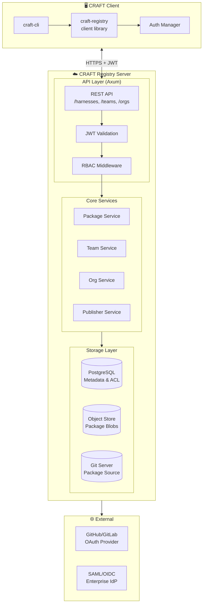
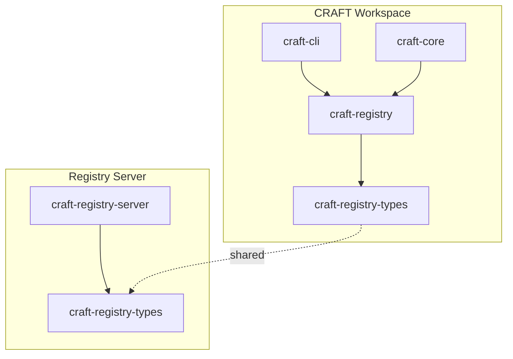
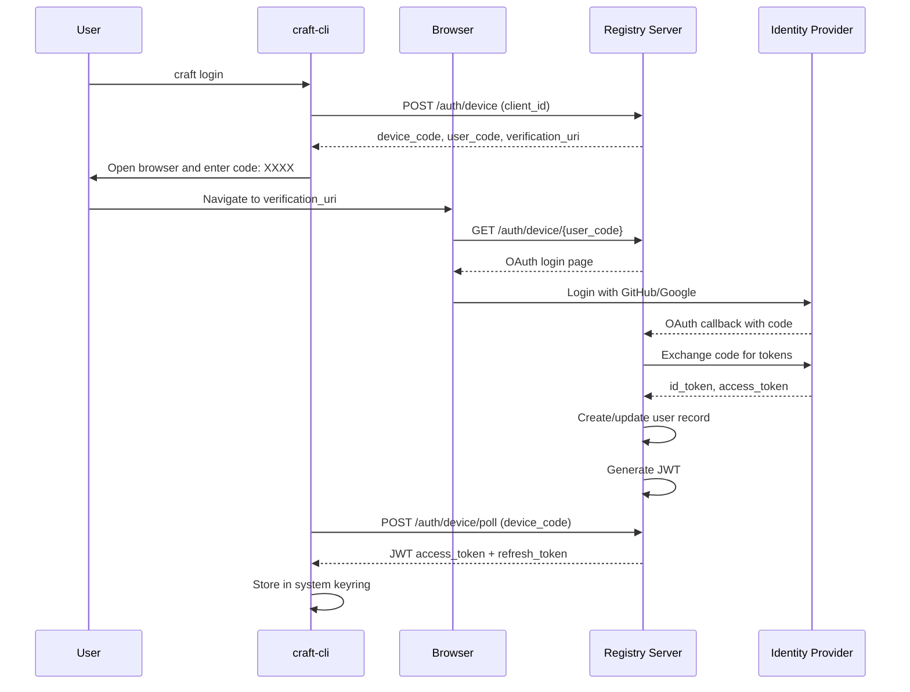
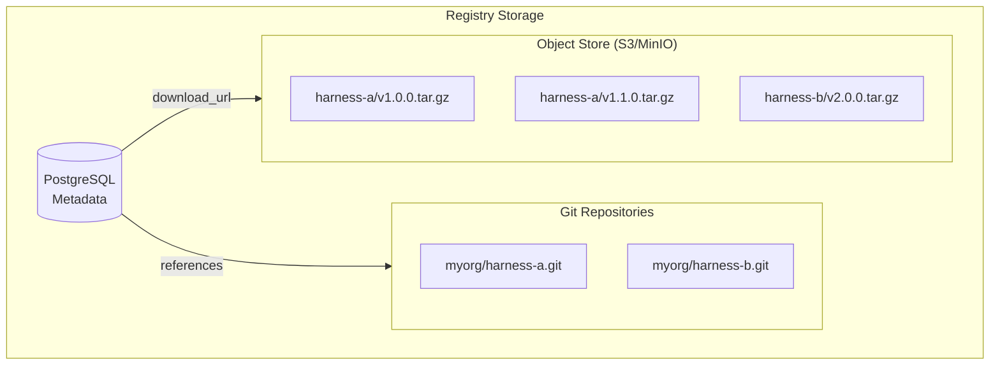
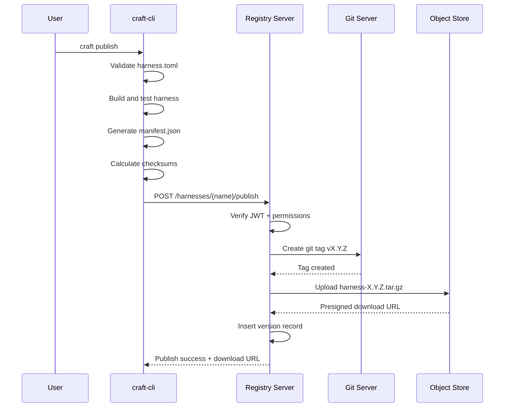

# Cloud Harness Hosting Architecture

> Private harness registries, team management, and Git-backed package distribution

## Goals

1. **Private Registries** — Self-hosted or cloud-managed harness registries for teams
2. **Version Management** — Semantic versioning, release channels, and dependency resolution
3. **Team ACL** — Organization and team-based access control with RBAC
4. **Git-Backed Distribution** — Harness packages stored as Git repositories with signed tags
5. **Registry Federation** — Discover and consume harnesses from multiple registries

## Architecture Overview



## Crate Structure

### New Crates

| Crate | Purpose | Dependencies |
|-------|---------|--------------|
| `craft-registry` | Client library for registry operations | reqwest, serde, tokio |
| `craft-registry-server` | Axum-based registry server | axum, sqlx, aws-sdk-s3 |
| `craft-registry-types` | Shared types (manifests, auth tokens) | serde, chrono |

### Crate Dependencies



## Data Model

### PostgreSQL Schema

```sql
-- Organizations (top-level billing/container entity)
CREATE TABLE organizations (
    id UUID PRIMARY KEY DEFAULT gen_random_uuid(),
    name VARCHAR(63) UNIQUE NOT NULL, -- URL-safe slug
    display_name VARCHAR(255) NOT NULL,
    description TEXT,
    avatar_url TEXT,
    tier VARCHAR(20) NOT NULL DEFAULT 'free', -- free, pro, enterprise
    created_at TIMESTAMPTZ NOT NULL DEFAULT NOW(),
    updated_at TIMESTAMPTZ NOT NULL DEFAULT NOW(),
    deleted_at TIMESTAMPTZ -- Soft delete
);

-- Teams (groups within orgs)
CREATE TABLE teams (
    id UUID PRIMARY KEY DEFAULT gen_random_uuid(),
    org_id UUID NOT NULL REFERENCES organizations(id) ON DELETE CASCADE,
    name VARCHAR(63) NOT NULL, -- URL-safe, unique per org
    display_name VARCHAR(255) NOT NULL,
    description TEXT,
    created_at TIMESTAMPTZ NOT NULL DEFAULT NOW(),
    
    UNIQUE(org_id, name)
);

-- Users (from external IdP)
CREATE TABLE users (
    id UUID PRIMARY KEY DEFAULT gen_random_uuid(),
    email VARCHAR(255) UNIQUE NOT NULL,
    name VARCHAR(255) NOT NULL,
    avatar_url TEXT,
    provider VARCHAR(50) NOT NULL, -- github, google, saml
    provider_user_id VARCHAR(255) NOT NULL,
    created_at TIMESTAMPTZ NOT NULL DEFAULT NOW(),
    
    UNIQUE(provider, provider_user_id)
);

-- Organization membership with roles
CREATE TABLE org_members (
    id UUID PRIMARY KEY DEFAULT gen_random_uuid(),
    org_id UUID NOT NULL REFERENCES organizations(id) ON DELETE CASCADE,
    user_id UUID NOT NULL REFERENCES users(id) ON DELETE CASCADE,
    role VARCHAR(20) NOT NULL DEFAULT 'member', -- owner, admin, member, billing
    joined_at TIMESTAMPTZ NOT NULL DEFAULT NOW(),
    
    UNIQUE(org_id, user_id)
);

-- Team membership
CREATE TABLE team_members (
    id UUID PRIMARY KEY DEFAULT gen_random_uuid(),
    team_id UUID NOT NULL REFERENCES teams(id) ON DELETE CASCADE,
    user_id UUID NOT NULL REFERENCES users(id) ON DELETE CASCADE,
    role VARCHAR(20) NOT NULL DEFAULT 'member', -- maintainer, member
    joined_at TIMESTAMPTZ NOT NULL DEFAULT NOW(),
    
    UNIQUE(team_id, user_id)
);

-- Harness packages
CREATE TABLE harnesses (
    id UUID PRIMARY KEY DEFAULT gen_random_uuid(),
    org_id UUID NOT NULL REFERENCES organizations(id) ON DELETE CASCADE,
    name VARCHAR(63) NOT NULL, -- URL-safe, unique per org
    display_name VARCHAR(255) NOT NULL,
    description TEXT,
    visibility VARCHAR(20) NOT NULL DEFAULT 'private', -- public, org, team, private
    default_team_id UUID REFERENCES teams(id), -- For team-scoped visibility
    created_at TIMESTAMPTZ NOT NULL DEFAULT NOW(),
    updated_at TIMESTAMPTZ NOT NULL DEFAULT NOW(),
    
    UNIQUE(org_id, name)
);

-- Harness versions/releases
CREATE TABLE harness_versions (
    id UUID PRIMARY KEY DEFAULT gen_random_uuid(),
    harness_id UUID NOT NULL REFERENCES harnesses(id) ON DELETE CASCADE,
    version VARCHAR(255) NOT NULL, -- SemVer
    revision VARCHAR(40) NOT NULL, -- Git commit hash
    manifest JSONB NOT NULL, -- craft.toml content
    readme TEXT, -- Rendered README
    changelog TEXT,
    download_url TEXT, -- Presigned S3 URL or Git archive
    checksum VARCHAR(64) NOT NULL, -- SHA-256
    size_bytes BIGINT NOT NULL,
    yanked BOOLEAN NOT NULL DEFAULT FALSE,
    published_by UUID NOT NULL REFERENCES users(id),
    published_at TIMESTAMPTZ NOT NULL DEFAULT NOW(),
    
    UNIQUE(harness_id, version),
    CONSTRAINT valid_semver CHECK (version ~ '^\d+\.\d+\.\d+.*$')
);

-- Dependencies between harnesses
CREATE TABLE harness_dependencies (
    id UUID PRIMARY KEY DEFAULT gen_random_uuid(),
    version_id UUID NOT NULL REFERENCES harness_versions(id) ON DELETE CASCADE,
    depends_on_org VARCHAR(63) NOT NULL, -- org name or 'core'
    depends_on_name VARCHAR(63) NOT NULL, -- harness name
    version_req VARCHAR(100) NOT NULL, -- SemVer requirement (e.g., "^1.2.0")
    optional BOOLEAN NOT NULL DEFAULT FALSE
);

-- Access control entries (granular permissions)
CREATE TABLE acl_entries (
    id UUID PRIMARY KEY DEFAULT gen_random_uuid(),
    resource_type VARCHAR(50) NOT NULL, -- 'harness', 'org', 'team'
    resource_id UUID NOT NULL,
    principal_type VARCHAR(50) NOT NULL, -- 'user', 'team'
    principal_id UUID NOT NULL,
    permission VARCHAR(50) NOT NULL, -- read, write, admin, publish
    granted_at TIMESTAMPTZ NOT NULL DEFAULT NOW(),
    granted_by UUID NOT NULL REFERENCES users(id),
    
    UNIQUE(resource_type, resource_id, principal_type, principal_id, permission)
);

-- API tokens for CI/automation
CREATE TABLE api_tokens (
    id UUID PRIMARY KEY DEFAULT gen_random_uuid(),
    org_id UUID NOT NULL REFERENCES organizations(id) ON DELETE CASCADE,
    name VARCHAR(255) NOT NULL,
    token_hash VARCHAR(64) NOT NULL, -- SHA-256 of token
    scopes JSONB NOT NULL DEFAULT '[]', -- ["read:harnesses", "write:harnesses"]
    created_by UUID NOT NULL REFERENCES users(id),
    created_at TIMESTAMPTZ NOT NULL DEFAULT NOW(),
    expires_at TIMESTAMPTZ,
    last_used_at TIMESTAMPTZ
);

-- Audit log
CREATE TABLE audit_log (
    id UUID PRIMARY KEY DEFAULT gen_random_uuid(),
    org_id UUID REFERENCES organizations(id),
    actor_type VARCHAR(20) NOT NULL, -- user, token, system
    actor_id UUID,
    action VARCHAR(100) NOT NULL, -- harness.published, team.created, etc.
    resource_type VARCHAR(50) NOT NULL,
    resource_id UUID,
    metadata JSONB,
    ip_address INET,
    user_agent TEXT,
    created_at TIMESTAMPTZ NOT NULL DEFAULT NOW()
);

-- Indexes for performance
CREATE INDEX idx_harnesses_org ON harnesses(org_id);
CREATE INDEX idx_versions_harness ON harness_versions(harness_id);
CREATE INDEX idx_versions_published ON harness_versions(published_at DESC);
CREATE INDEX idx_acl_resource ON acl_entries(resource_type, resource_id);
CREATE INDEX idx_audit_org ON audit_log(org_id, created_at DESC);
CREATE INDEX idx_dependencies_version ON harness_dependencies(version_id);
```

### Rust Type Definitions

```rust
// craft-registry-types/src/lib.rs

use serde::{Deserialize, Serialize};
use chrono::{DateTime, Utc};
use uuid::Uuid;

/// Unique identifier for org-scoped harness names
#[derive(Clone, Debug, Serialize, Deserialize)]
pub struct QualifiedName {
    pub org: String,
    pub name: String,
}

impl QualifiedName {
    pub fn parse(s: &str) -> Option<Self> {
        let parts: Vec<&str> = s.split('/').collect();
        if parts.len() == 2 {
            Some(Self {
                org: parts[0].to_string(),
                name: parts[1].to_string(),
            })
        } else {
            None
        }
    }
    
    pub fn to_string(&self) -> String {
        format!("{}/{}", self.org, self.name)
    }
}

/// Organization entity
#[derive(Clone, Debug, Serialize, Deserialize)]
pub struct Organization {
    pub id: Uuid,
    pub name: String, // URL-safe slug
    pub display_name: String,
    pub description: Option<String>,
    pub avatar_url: Option<String>,
    pub tier: OrgTier,
    pub created_at: DateTime<Utc>,
}

#[derive(Clone, Debug, Serialize, Deserialize)]
pub enum OrgTier {
    Free,
    Pro,
    Enterprise,
}

/// Team within an organization
#[derive(Clone, Debug, Serialize, Deserialize)]
pub struct Team {
    pub id: Uuid,
    pub org_id: Uuid,
    pub name: String,
    pub display_name: String,
    pub description: Option<String>,
    pub member_count: i64,
}

/// Harness package metadata
#[derive(Clone, Debug, Serialize, Deserialize)]
pub struct Harness {
    pub id: Uuid,
    pub qualified_name: QualifiedName,
    pub display_name: String,
    pub description: Option<String>,
    pub visibility: Visibility,
    pub default_team_id: Option<Uuid>,
    pub created_at: DateTime<Utc>,
    pub updated_at: DateTime<Utc>,
}

#[derive(Clone, Debug, Serialize, Deserialize)]
pub enum Visibility {
    /// Public - visible to everyone
    Public,
    /// Org - visible to all org members
    Org,
    /// Team - visible to specific team members
    Team,
    /// Private - visible only to explicitly granted users
    Private,
}

/// Harness version/release
#[derive(Clone, Debug, Serialize, Deserialize)]
pub struct HarnessVersion {
    pub id: Uuid,
    pub harness_id: Uuid,
    pub version: semver::Version,
    pub revision: String, // Git commit hash
    pub manifest: Manifest,
    pub readme: Option<String>,
    pub changelog: Option<String>,
    pub download_url: String,
    pub checksum: String, // SHA-256
    pub size_bytes: i64,
    pub yanked: bool,
    pub published_by: UserSummary,
    pub published_at: DateTime<Utc>,
}

/// Minimal user info for display
#[derive(Clone, Debug, Serialize, Deserialize)]
pub struct UserSummary {
    pub id: Uuid,
    pub name: String,
    pub avatar_url: Option<String>,
}

/// API token for CI/automation
#[derive(Clone, Debug, Serialize, Deserialize)]
pub struct ApiToken {
    pub id: Uuid,
    pub org_id: Uuid,
    pub name: String,
    pub scopes: Vec<String>,
    pub created_at: DateTime<Utc>,
    pub expires_at: Option<DateTime<Utc>>,
    pub last_used_at: Option<DateTime<Utc>>,
    // Token value only returned on creation
}
```

## Authentication & Authorization

### OAuth Integration Flow



### RBAC Permission Model

```rust
// craft-registry-types/src/acl.rs

/// Resource types for ACL
#[derive(Clone, Debug, Serialize, Deserialize)]
pub enum ResourceType {
    Organization,
    Team,
    Harness,
}

/// Principal types (who can have permissions)
#[derive(Clone, Debug, Serialize, Deserialize)]
pub enum PrincipalType {
    User,
    Team,
    ApiToken,
}

/// Available permissions
#[derive(Clone, Debug, Serialize, Deserialize)]
pub enum Permission {
    // Org-level
    OrgRead,
    OrgAdmin,
    OrgBilling,
    
    // Team-level
    TeamRead,
    TeamWrite,
    
    // Harness-level
    HarnessRead,
    HarnessWrite,
    HarnessPublish,
    HarnessDelete,
    HarnessAdmin,
}

/// Role definitions (convenience groupings)
pub struct Role {
    pub name: &'static str,
    pub permissions: Vec<Permission>,
}

pub const ORG_OWNER: Role = Role {
    name: "org:owner",
    permissions: vec![
        Permission::OrgRead, Permission::OrgAdmin, Permission::OrgBilling,
        Permission::TeamRead, Permission::TeamWrite,
        Permission::HarnessRead, Permission::HarnessWrite, 
        Permission::HarnessPublish, Permission::HarnessDelete, Permission::HarnessAdmin,
    ],
};

pub const TEAM_MAINTAINER: Role = Role {
    name: "team:maintainer",
    permissions: vec![
        Permission::TeamRead, Permission::TeamWrite,
        Permission::HarnessRead, Permission::HarnessWrite, Permission::HarnessPublish,
    ],
};

pub const HARNESS_READER: Role = Role {
    name: "harness:reader",
    permissions: vec![Permission::HarnessRead],
};

/// Check if principal has permission on resource
pub async fn check_permission(
    db: &PgPool,
    principal: Principal,
    resource: Resource,
    permission: Permission,
) -> Result<bool, AclError> {
    // 1. Check direct ACL entry
    let has_direct = sqlx::query_scalar::<_, bool>(
        "SELECT EXISTS(SELECT 1 FROM acl_entries WHERE resource_type = $1 AND resource_id = $2 
         AND principal_type = $3 AND principal_id = $4 AND permission = $5)"
    )
    .bind(resource.resource_type())
    .bind(resource.id())
    .bind(principal.principal_type())
    .bind(principal.id())
    .bind(permission.as_str())
    .fetch_one(db)
    .await?;
    
    if has_direct {
        return Ok(true);
    }
    
    // 2. Check team membership (for user principals)
    if let Principal::User(user_id) = principal {
        let has_via_team = sqlx::query_scalar::<_, bool>(
            "SELECT EXISTS(SELECT 1 FROM acl_entries ae
             JOIN team_members tm ON ae.principal_id = tm.team_id
             WHERE ae.resource_type = $1 AND ae.resource_id = $2
             AND tm.user_id = $3 AND ae.permission = $4)"
        )
        .bind(resource.resource_type())
        .bind(resource.id())
        .bind(user_id)
        .bind(permission.as_str())
        .fetch_one(db)
        .await?;
        
        if has_via_team {
            return Ok(true);
        }
    }
    
    // 3. Check org membership with role permissions
    let org_id = resource.org_id();
    let has_via_org = sqlx::query_scalar::<_, bool>(
        "SELECT EXISTS(SELECT 1 FROM org_members om
         WHERE om.org_id = $1 AND om.user_id = $2
         AND om.role = ANY($3))"
    )
    .bind(org_id)
    .bind(principal.id())
    .bind(&["owner", "admin"])
    .fetch_one(db)
    .await?;
    
    Ok(has_via_org)
}
```

## Git-Backed Package Distribution

### Storage Architecture

Harness packages are stored using a hybrid approach:
- **Metadata**: PostgreSQL (versions, manifests, ACLs)
- **Source**: Git repositories (complete version history)
- **Blobs**: Object storage (cached archives for fast downloads)



### Git Repository Structure

Each harness is stored as a bare Git repository with tags for releases:

```
myorg/harness-a.git/
├── HEAD                    -> refs/heads/main
├── config                  # Git config
├── objects/                # Git objects
├── refs/
│   ├── heads/
│   │   └── main            # Default branch
│   └── tags/
│       ├── v0.1.0         # Release tag
│       ├── v0.2.0         # Release tag
│       └── v1.0.0         # Release tag (annotated + signed)
└── info/exclude
```

### Publishing Flow



### Package Archive Format

```
craft-harness-1.0.0.tar.gz
├── craft.toml              # Manifest (copied from harness.toml)
├── README.md               # Documentation
├── harness/
│   ├── system.md           # System prompt
│   ├── user.md.template    # User prompt template
│   └── metadata.toml       # Additional metadata
├── tools/                  # Tool definitions
│   ├── http.toml
│   └── fs.toml
└── checksums.txt           # SHA-256 checksums