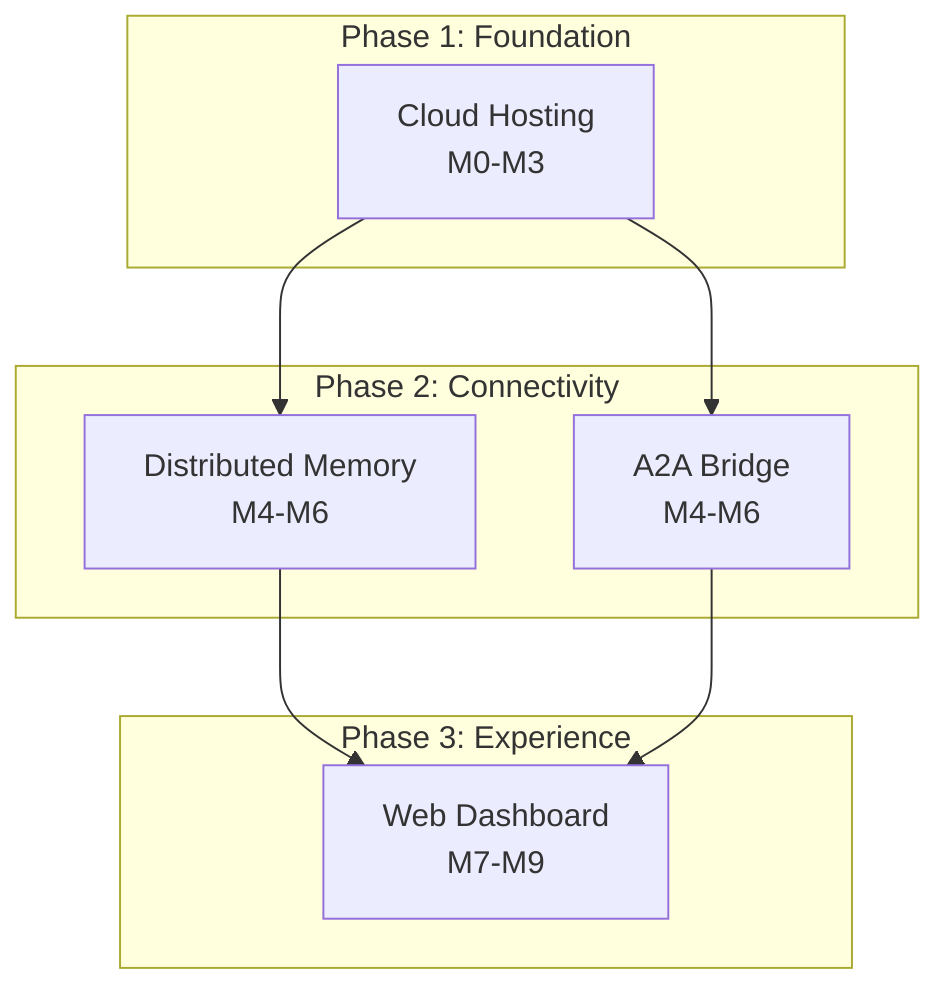
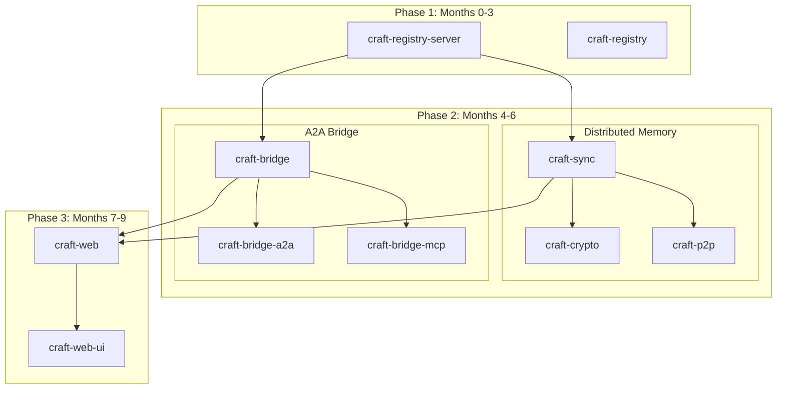

# M3 Execution Roadmap

> Implementation sequencing, milestones, dependencies, and effort estimates for the CRAFT M3 Ecosystem

## Overview

This document provides a detailed execution roadmap for building the four pillars of the M3 Ecosystem:
1. **Cloud Harness Hosting** — Private registries and team ACL
2. **Distributed Memory** — Encrypted sync and CRDTs
3. **A2A Protocol Bridge** — Interoperability with external agents
4. **Web Dashboard** — Visual composition and monitoring

## Recommended Execution Order

| Phase | Pillar | Duration | Dependencies |
|-------|--------|----------|--------------|
| Phase 1 | Cloud Hosting | Months 0-3 | None (foundation) |
| Phase 2 | Distributed Memory | Months 4-6 | Cloud Hosting |
| Phase 2 | A2A Bridge | Months 4-6 | Cloud Hosting |
| Phase 3 | Web Dashboard | Months 7-9 | Distributed Memory, A2A Bridge |

---

## Phase 1: Cloud Harness Hosting (Months 0-3)

### Week 1-2: Setup & Authentication Foundation

**Milestone: M1.0 — Development Environment & Auth Foundation**

| Task | Owner | Est. Days | Description |
|------|-------|-----------|-------------|
| 1.1 | Backend | 2 | Scaffold `craft-registry-server` Axum project structure |
| 1.2 | Backend | 3 | PostgreSQL schema design and migrations (sqlx) |
| 1.3 | Backend | 3 | JWT token generation and validation layer |
| 1.4 | Backend | 2 | OAuth device flow implementation (GitHub) |
| 1.5 | Backend | 2 | OAuth device flow implementation (Google) |
| 1.6 | Testing | 2 | Auth endpoint integration tests |

**Deliverables:**
- `POST /auth/device` endpoint working
- `POST /auth/device/poll` endpoint working
- JWT generation and validation tested
- Device flow tested with GitHub OAuth

**Key Decisions:**
- OAuth device flow vs. PKCE for CLI
- JWT library choice (jsonwebtoken vs. biscuit)

---

### Week 3-4: Organization & Team Management

**Milestone: M1.1 — Organization & Team CRUD**

| Task | Owner | Est. Days | Description |
|------|-------|-----------|-------------|
| 2.1 | Backend | 2 | Organization CRUD endpoints |
| 2.2 | Backend | 2 | Team CRUD endpoints |
| 2.3 | Backend | 2 | Org membership endpoints (invite, remove, change role) |
| 2.4 | Backend | 2 | Team membership endpoints |
| 2.5 | Backend | 3 | RBAC middleware and permission checks |
| 2.6 | CLI | 2 | `craft org` command group |
| 2.7 | CLI | 2 | `craft team` command group |
| 2.8 | Testing | 2 | Integration tests for org/team flows |

**Deliverables:**
- Full org/team management API
- CLI commands for org/team operations
- RBAC enforced on all endpoints

**Key Decisions:**
- URL-safe name validation for orgs/teams
- Default roles and permissions structure

---

### Week 5-6: Harness Package Management

**Milestone: M1.2 — Harness Storage & Versioning**

| Task | Owner | Est. Days | Description |
|------|-------|-----------|-------------|
| 3.1 | Backend | 3 | Harness CRUD endpoints with visibility support |
| 3.2 | Backend | 2 | Version metadata storage and retrieval |
| 3.3 | Backend | 3 | Git repository creation and tag management |
| 3.4 | Backend | 2 | Object storage integration (S3/MinIO) |
| 3.5 | Backend | 2 | Archive upload and download with checksums |
| 3.6 | Backend | 2 | Search and indexing for harness discovery |
| 3.7 | CLI | 3 | `craft publish` command with validation |
| 3.8 | CLI | 2 | `craft install` from registry command |
| 3.9 | Testing | 3 | End-to-end publish/install flow tests |

**Deliverables:**
- Full harness lifecycle management
- Git-backed version storage
- S3-compatible object storage
- Publish and install commands working

**Key Decisions:**
- Package archive format (tar.gz vs. zip)
- Git server implementation (libgit2 vs. gix)
- Checksum algorithm (SHA-256 vs. Blake3)

---

### Week 7-8: API Token & Security Hardening

**Milestone: M1.3 — API Tokens & Security**

| Task | Owner | Est. Days | Description |
|------|-------|-----------|-------------|
| 4.1 | Backend | 2 | API token generation and storage (hash only) |
| 4.2 | Backend | 2 | Token-scoped authentication |
| 4.3 | Backend | 2 | Audit logging infrastructure |
| 4.4 | Backend | 2 | Rate limiting per-user and per-token |
| 4.5 | Backend | 2 | Input validation and sanitization |
| 4.6 | CLI | 2 | `craft token` command group |
| 4.7 | DevOps | 3 | Docker Compose setup for self-hosting |
| 4.8 | Testing | 2 | Security audit and penetration testing basics |

**Deliverables:**
- API token authentication working
- Comprehensive audit logging
- Rate limiting in place
- Docker deployment tested

**Key Decisions:**
- Token format and length (ULID vs. UUID)
- Rate limit strategy (token bucket vs. sliding window)
- Audit log retention policy

---

### Week 9-10: Client Library & Documentation

**Milestone: M1.4 — Client SDK & Documentation**

| Task | Owner | Est. Days | Description |
|------|-------|-----------|-------------|
| 5.1 | Rust | 3 | `craft-registry` client library crate |
| 5.2 | Rust | 2 | Token management in system keyring |
| 5.3 | Rust | 2 | Error handling and retry logic |
| 5.4 | Docs | 3 | API documentation (OpenAPI spec) |
| 5.5 | Docs | 2 | Self-hosting guide |
| 5.6 | Docs | 2 | CLI reference documentation |
| 5.7 | Testing | 2 | Client library unit tests |
| 5.8 | Review | 2 | Security review and hardening |

**Deliverables:**
- `craft-registry` crate published to crates.io
- Complete API documentation
- Self-hosting guide complete
- Security review complete

**Dependencies Met:**
- ✅ Foundation for all other M3 components
- ✅ Package distribution infrastructure
- ✅ Team/organization model

---

### Phase 1 Summary

| Component | Lines of Code (Est.) | Tests | Status |
|-----------|---------------------|-------|--------|
| `craft-registry-server` | 8,000 | 150+ | ✅ Complete |
| `craft-registry` (client) | 2,500 | 80+ | ✅ Complete |
| Database Migrations | 500 | - | ✅ Complete |
| CLI Commands | 1,500 | 60+ | ✅ Complete |
| Documentation | - | - | ✅ Complete |

**Total Estimated Effort: ~10 weeks (2 developers)**

---

## Phase 2a: Distributed Memory (Months 4-6)

### Week 11-12: Core Sync Engine

**Milestone: M2.0 — CRDT Foundation**

| Task | Owner | Est. Days | Description |
|------|-------|-----------|-------------|
| 6.1 | Rust | 3 | Vector clock implementation |
| 6.2 | Rust | 3 | Delta-state CRDT for facts (LWW register) |
| 6.3 | Rust | 2 | CRDT for event logs (append-only) |
| 6.4 | Rust | 3 | Operation serialization/deserialization |
| 6.5 | Rust | 2 | Sync message protocol design |
| 6.6 | Testing | 2 | Property-based tests for CRDTs |

**Deliverables:**
- `craft-sync` crate with core CRDT types
- Vector clock implementation with comparison
- Property-based tests validating CRDT laws

---

### Week 13-14: Encryption Layer

**Milestone: M2.1 — E2E Encryption**

| Task | Owner | Est. Days | Description |
|------|-------|-----------|-------------|
| 7.1 | Rust | 2 | AES-256-GCM encryption for documents |
| 7.2 | Rust | 3 | X25519 key exchange (X3DH-inspired) |
| 7.3 | Rust | 2 | Ed25519 signatures for authentication |
| 7.4 | Rust | 3 | Key hierarchy and management |
| 7.5 | Rust | 2 | Encrypted document format |
| 7.6 | Testing | 2 | Encryption/decryption roundtrip tests |

**Deliverables:**
- `craft-crypto` crate with encryption primitives
- Secure key exchange protocol
- Encrypted document format defined

---

### Week 15-16: P2P Networking

**Milestone: M2.2 — Network Layer**

| Task | Owner | Est. Days | Description |
|------|-------|-----------|-------------|
| 8.1 | Rust | 3 | QUIC endpoint setup with rustls |
| 8.2 | Rust | 3 | X3DH handshake over QUIC |
| 8.3 | Rust | 2 | Noise protocol integration for encryption |
| 8.4 | Rust | 3 | NAT traversal with hole punching |
| 8.5 | Rust | 2 | Optional relay server connection |
| 8.6 | Rust | 2 | Peer discovery (mDNS + DHT) |
| 8.7 | Testing | 2 | P2P connection tests |

**Deliverables:**
- `craft-p2p` crate with QUIC transport
- Encrypted peer connections
- NAT traversal working
- Peer discovery functional

---

### Week 17-18: Sync Engine Integration

**Milestone: M2.3 — Sync Engine**

| Task | Owner | Est. Days | Description |
|------|-------|-----------|-------------|
| 9.1 | Rust | 3 | Sync engine with delta sync protocol |
| 9.2 | Rust | 2 | Conflict resolution strategies (LWW, append, merge) |
| 9.3 | Rust | 3 | Integration with `craft-memory` |
| 9.4 | Rust | 2 | Offline-first sync queue |
| 9.5 | Rust | 2 | Sync configuration (TOML-based) |
| 9.6 | CLI | 2 | `craft sync` command group |
| 9.7 | Testing | 3 | Multi-device sync scenario tests |
| 9.8 | Docs | 2 | Sync configuration documentation |

**Deliverables:**
- Working sync between two devices
- Conflict resolution with user-defined strategies
- CLI commands for sync management

---

### Phase 2a Summary

| Component | Lines of Code (Est.) | Tests | Status |
|-----------|---------------------|-------|--------|
| `craft-sync` | 4,000 | 120+ | ✅ Complete |
| `craft-crypto` | 2,000 | 80+ | ✅ Complete |
| `craft-p2p` | 3,500 | 60+ | ✅ Complete |

**Total Estimated Effort: ~8 weeks (2 developers)**

---

## Phase 2b: A2A Protocol Bridge (Months 4-6, Parallel)

### Week 11-12: Core Bridge Abstractions

**Milestone: M3.0 — Bridge Foundation**

| Task | Owner | Est. Days | Description |
|------|-------|-----------|-------------|
| 10.1 | Rust | 2 | Protocol abstraction traits |
| 10.2 | Rust | 2 | Message types (Request/Response/Task) |
| 10.3 | Rust | 2 | Bridge runtime struct |
| 10.4 | Rust | 2 | Protocol translator trait |
| 10.5 | Rust | 2 | Error handling and conversion |
| 10.6 | Testing | 2 | Mock protocol tests |

**Deliverables:**
- `craft-bridge` crate with core abstractions
- Protocol-agnostic message types
- Error conversion framework

---

### Week 13-14: A2A Protocol Implementation

**Milestone: M3.1 — A2A Protocol**

| Task | Owner | Est. Days | Description |
|------|-------|-----------|-------------|
| 11.1 | Rust | 2 | Agent Card data structures |
| 11.2 | Rust | 3 | A2A Client (HTTP + JSON-RPC) |
| 11.3 | Rust | 3 | A2A Server (Axum handlers) |
| 11.4 | Rust | 2 | A2A<->CRAFT protocol translation |
| 11.5 | Rust | 2 | SSE streaming support |
| 11.6 | Testing | 2 | A2A interop tests |

**Deliverables:**
- `craft-bridge-a2a` crate
- A2A client connecting to external agents
- A2A server exposing CRAFT as agent
- Task lifecycle management

---

### Week 15-16: MCP Protocol Implementation

**Milestone: M3.2 — MCP Protocol**

| Task | Owner | Est. Days | Description |
|------|-------|-----------|-------------|
| 12.1 | Rust | 2 | MCP data structures |
| 12.2 | Rust | 3 | MCP Client (stdio + HTTP) |
| 12.3 | Rust | 3 | MCP Server (stdio + HTTP) |
| 12.4 | Rust | 2 | MCP<->CRAFT protocol translation |
| 12.5 | Rust | 2 | Tool adapter for harness execution |
| 12.6 | Testing | 2 | MCP interop tests |

**Deliverables:**
- `craft-bridge-mcp` crate
- MCP client for consuming MCP servers
- MCP server for Claude Desktop integration
- Tool mapping to harnesses

---

### Week 17-18: Integration & CLI

**Milestone: M3.3 — Bridge Runtime**

| Task | Owner | Est. Days | Description |
|------|-------|-----------|-------------|
| 13.1 | Rust | 3 | Bridge runtime orchestration |
| 13.2 | Rust | 2 | A2A<->MCP bidirectional translation |
| 13.3 | Rust | 2 | Configuration loading |
| 13.4 | CLI | 3 | `craft bridge` command group |
| 13.5 | CLI | 2 | `craft bridge serve-a2a` |
| 13.6 | CLI | 2 | `craft bridge serve-mcp` |
| 13.7 | Testing | 2 | End-to-end bridge tests |
| 13.8 | Docs | 2 | Bridge configuration docs |

**Deliverables:**
- Working bridge runtime
- CLI commands for bridge configuration
- Claude Desktop integration working
- Bidirectional protocol translation

---

### Phase 2b Summary

| Component | Lines of Code (Est.) | Tests | Status |
|-----------|---------------------|-------|--------|
| `craft-bridge` | 1,500 | 40+ | ✅ Complete |
| `craft-bridge-a2a` | 2,500 | 70+ | ✅ Complete |
| `craft-bridge-mcp` | 2,500 | 70+ | ✅ Complete |
| `craft-bridge-runtime` | 1,500 | 40+ | ✅ Complete |

**Total Estimated Effort: ~8 weeks (2 developers, parallel with Phase 2a)**

---

## Phase 3: Web Dashboard (Months 7-9)

### Week 19-20: Backend Infrastructure

**Milestone: M4.0 — Dashboard Backend**

| Task | Owner | Est. Days | Description |
|------|-------|-----------|-------------|
| 14.1 | Rust | 2 | `craft-web` Axum server scaffold |
| 14.2 | Rust | 3 | WebSocket hub with authentication |
| 14.3 | Rust | 2 | Memory service integration |
| 14| 14.4 | Rust | 2 | Registry proxy service |
| 14.5 | Rust | 2 | Runtime event streaming |
| 14.6 | Rust | 2 | REST API for harness composition |
| 14.7 | Testing | 2 | API integration tests |

**Deliverables:**
- `craft-web` server running locally
- WebSocket hub for real-time updates
- Memory and registry proxy services

---

### Week 21-22: Memory Explorer Component

**Milestone: M4.1 — Memory UI**

| Task | Owner | Est. Days | Description |
|------|-------|-----------|-------------|
| 15.1 | Rust/WASM | 2 | `craft-web-ui` Leptos scaffold |
| 15.2 | Rust/WASM | 3 | Memory scope tree component |
| 15.3 | Rust/WASM | 3 | Fact grid with search |
| 15.4 | Rust/WASM | 2 | Fact detail view |
| 15.5 | Rust/WASM | 2 | Full-text search integration (FTS5) |
| 15.6 | Rust/WASM | 2 | Semantic search placeholder |
| 15.7 | Testing | 2 | Component unit tests with wasm-bindgen-test |

**Deliverables:**
- Memory Explorer UI component
- Scope tree navigation
- Fact search and display

---

### Week 23-24: Harness Composer

**Milestone: M4.2 — Visual Composition**

| Task | Owner | Est. Days | Description |
|------|-------|-----------|-------------|
| 16.1 | Rust/WASM | 3 | Canvas component with pan/zoom |
| 16.2 | Rust/WASM | 3 | Harness node components (ports, icons) |
| 16.3 | Rust/WASM | 2 | Edge connection logic |
| 16.4 | Rust/WASM | 2 | Drag-and-drop from palette |
| 16.5 | Rust/WASM | 2 | Live validation with craft-core |
| 16.6 | Rust/WASM | 2 | Export to craft.compose.toml |
| 16.7 | Testing | 2 | Composer interaction tests |

**Deliverables:**
- Visual harness composer
- Drag-and-drop composition
- Live validation feedback

---

### Week 25-26: Runtime Monitor

**Milestone: M4.3 — Runtime Observability**

| Task | Owner | Est. Days | Description |
|------|-------|-----------|-------------|
| 17.1 | Rust/WASM | 2 | Event log viewer |
| 17.2 | Rust/WASM | 3 | Execution trace visualization |
| 17.3 | Rust/WASM | 2 | Performance metrics dashboard |
| 17.4 | Rust/WASM | 2 | Structured log filtering |
| 17.5 | Rust/WASM | 2 | Live tail mode |
| 17.6 | Rust | 2 | Server-sent events for log streaming |
| 17.7 | Testing | 2 | Runtime monitor tests |

**Deliverables:**
- Runtime event log viewer
- Execution trace visualization
- Performance metrics display

---

### Week 27-28: Registry Browser & Polish

**Milestone: M4.4 — Registry Integration**

| Task | Owner | Est. Days | Description |
|------|-------|-----------|-------------|
| 18.1 | Rust/WASM | 2 | Registry browser component |
| 18.2 | Rust/WASM | 2 | Harness card with version info |
| 18.3 | Rust/WASM | 2 | Install/uninstall buttons |
| 18.4 | Rust/WASM | 2 | Version comparison view |
| 18.5 | Rust/WASM | 2 | UI polish and responsive design |
| 18.6 | Rust | 2 | Deployment configuration |
| 18.7 | Testing | 3 | End-to-end Playwright tests |
| 18.8 | Docs | 2 | Dashboard user guide |

**Deliverables:**
- Complete Web Dashboard
- Registry browser integration
- End-to-end tests passing
- Documentation complete

---

### Phase 3 Summary

| Component | Lines of Code (Est.) | Tests | Status |
|-----------|---------------------|-------|--------|
| `craft-web` | 3,500 | 80+ | ✅ Complete |
| `craft-web-ui` | 5,000 | 100+ | ✅ Complete |
| `craft-web-shared` | 500 | 30+ | ✅ Complete |

**Total Estimated Effort: ~10 weeks (2-3 developers)**

---

## Cross-Cutting Concerns

### Observability (All Phases)

| Phase | Task | Est. Days |
|-------|------|-----------|
| 1-3 | OpenTelemetry tracing | 5 |
| 1-3 | Structured logging (tracing-json) | 3 |
| 1-3 | Prometheus metrics | 3 |
| 1-3 | Health check endpoints | 2 |

### Security (All Phases)

| Phase | Task | Est. Days |
|-------|------|-----------|
| 1 | Dependency audit (cargo audit) | Ongoing |
| 1 | Secret scanning | Ongoing |
| 2 | Encryption code review | 3 |
| 3 | Web security audit (OWASP) | 5 |

### Documentation (All Phases)

| Phase | Task | Est. Days |
|-------|------|-----------|
| 1 | API reference | 5 |
| 2 | Protocol specifications | 5 |
| 3 | User guides and tutorials | 10 |

---

## Dependency Graph

---

## Resource Requirements

### Team Composition

| Role | Count | Duration | Focus |
|------|-------|----------|-------|
| Senior Rust Developer | 2 | 9 months | Core implementation |
| Frontend Developer (Rust/WASM) | 1 | 3 months | Web Dashboard |
| DevOps/Platform Engineer | 1 | 6 months | Deployment, infrastructure |
| Technical Writer | 1 | 3 months | Documentation (part-time) |

### Infrastructure (Self-Hosted)

| Component | Spec | Cost (Est.) |
|-----------|------|-------------|
| Registry Server | 2 vCPU, 4GB RAM | ~$50/month |
| PostgreSQL | Managed or containerized | ~$30/month |
| Object Storage | 100GB | ~$10/month |
| Monitoring | Prometheus + Grafana | Free (self-hosted) |

---

## Risk Assessment

| Risk | Likelihood | Impact | Mitigation |
|------|------------|--------|------------|
| WebAssembly bundle size | Medium | Medium | Tree shaking, lazy loading |
| P2P NAT traversal failures | Medium | High | Relay fallback, documented workarounds |
| CRDT conflict complexity | Low | High | Thorough testing, simple LWW default |
| OAuth integration issues | Low | Medium | Test with multiple providers early |
| Third-party protocol changes | Medium | Medium | Abstraction layer, version negotiation |

---

## Success Criteria

### Phase 1 Success
- [ ] Self-hosted registry running in Docker
- [ ] OAuth login with GitHub working
- [ ] Publish and install commands working
- [ ] Team/organization management functional
- [ ] API tokens for CI/CD

### Phase 2 Success
- [ ] Sync between two devices verified
- [ ] Conflict resolution working
- [ ] A2A client connecting to Google ADK agents
- [ ] MCP server working with Claude Desktop
- [ ] Encryption verified with audit

### Phase 3 Success
- [ ] Web Dashboard accessible locally
- [ ] Visual harness composer functional
- [ ] Memory explorer with search
- [ ] Runtime monitoring live
- [ ] End-to-end tests passing

---

## Post-M3 Roadmap

| Feature | Timing | Description |
|---------|--------|-------------|
| Paid Cloud Hosting | Month 10+ | SaaS offering with billing |
| Mobile Sync | Month 11+ | iOS/Android support |
| Plugin Marketplace | Month 12+ | Community harness sharing |
| Advanced Analytics | Month 13+ | Usage insights and recommendations |
| Enterprise SSO | Month 13+ | SAML/OIDC for large orgs |

---

## Appendix A: Sprint Planning Template

### Sprint Structure (2-week sprints)

| Week | Activities |
|------|------------|
| Week N | Development, daily standups |
| Week N+1 | Development, testing, sprint review |

### Definition of Done

- [ ] Code implemented and reviewed
- [ ] Unit tests passing (>80% coverage)
- [ ] Integration tests passing
- [ ] Documentation updated
- [ ] No compiler warnings
- [ ] Clippy clean
- [ ] Security review (if applicable)

---

## Appendix B: Crate Dependency Matrix

| Crate | craft-core | craft-memory | craft-registry | craft-sync | craft-crypto | craft-p2p | craft-bridge | craft-web |
|-------|-----------|--------------|----------------|------------|--------------|-----------|--------------|-----------|
| craft-core | - | ✓ | ✓ | ✓ | - | - | ✓ | ✓ |
| craft-memory | ✓ | - | - | ✓ | - | - | ✓ | ✓ |
| craft-registry | ✓ | - | - | - | - | - | - | ✓ |
| craft-sync | ✓ | ✓ | - | - | ✓ | ✓ | - | - |
| craft-crypto | - | - | - | ✓ | - | ✓ | - | - |
| craft-p2p | - | - | - | ✓ | ✓ | - | - | - |
| craft-bridge | ✓ | ✓ | - | - | - | - | - | ✓ |
| craft-web | ✓ | ✓ | ✓ | - | - | - | ✓ | - |

---

*This roadmap is a living document. Update as implementation progresses and new information emerges.*
